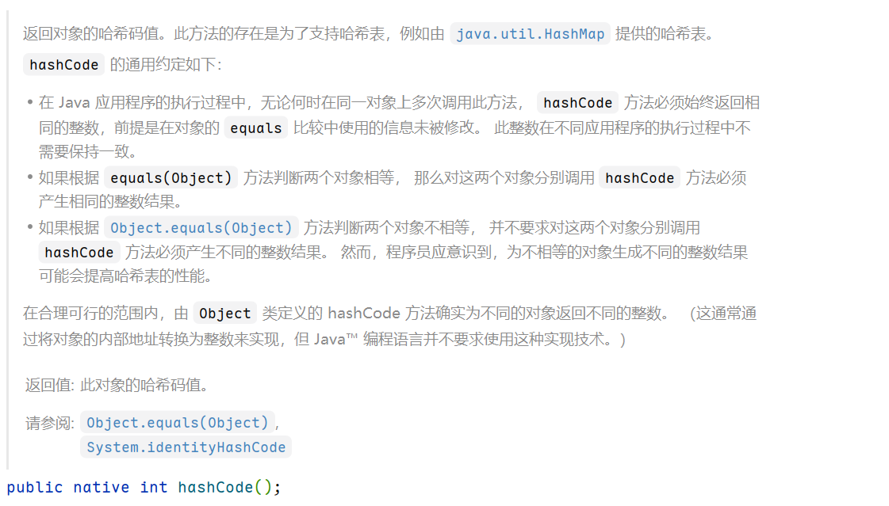
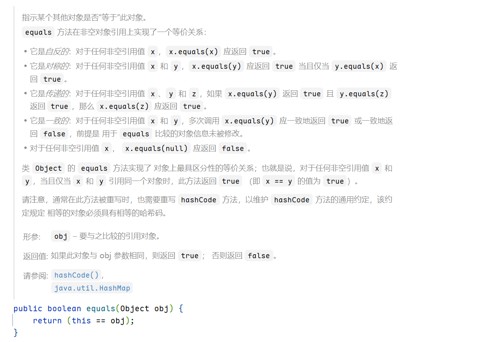

# HashMap

## 数据结构

- jdk 1.7 使用的是数组 + 链表
- jdk 1.8 使用的是 数组+ 链表+ 红黑树：
  - 树化：一条链表长度>8 并且 hashmap 的节点总数大于64 就转换为数据结构，使用红黑树
  - 退化：一条链表长度<6

## 扩容

初始是16，负载因子是0.75，threshold = 16*0.75 =12

## put 详细流程：`putVal （hash(key)，key，value）`

定义了一个 e 的节点，去判断是否找到key 相同的节点

1. 是不是为当前表是否已经初始化，如果没有，那么调用 `resize()`<mark>（这是整个方法中第一个resize）</mark> 去初始化
2. 计算 桶的下标，判断这个桶是不是为null
   1. 如果桶为空，直接放这个节点下去
   2. 如果桶不为空
      1. 先判断第一个节点 和 待插入的节点 hash和key 是不是相同
         1. 相同，相当于就找到了这个节点
      2. 判断树的节点是不是 红黑树的节点，如果是，调用红黑树的插入
      3. 以下说明是正常链表的逻辑了
         1. 遍历链表，如果遍历完了还没有找到 key 相同的，尾插。判断 是否是否树化
         2. 如果遍历过程中，找到了。跳出循环。

判断 e 是不是为null

- 如果是null，在过程中也进行了插入操作
- 如果不是null，替换值了，返回旧值

判断元素个数是否超过阈值，如果超过 扩容<mark>（这是整个方法中第二个resize）</mark>

## resize () 过程

- 旧hash 表
- 旧hash 表长度
- 旧阈值
- 定义新长度、阈值

1. 已经初始化了 ：通过判断旧长度 是 大于0
   1. 是否可以扩，
2. 阈值设置了，hash 表没有初始化
3. 都没有设置，设置为默认的 阈值和 容量。

如果桶里面仅有一个节点，路由公式，hash & (newCap-1)

如果是树，拆分树

如果是 链表，那么1. 7 rehash, 1.8 是判断，`hash & oldCap ==0` 低位，否则高位
前提: 我们知道分配后的元素可能出现在两个地方，第一个是旧索引，第二个是旧索引 + `oldCap`
那么可以通过 `hash & oldCap ==0`判断。

- `oldCap` 总是 `2ⁿ`，在二进制里是个“1 后面跟 n 个 0”（例如 8 = `1000`）。
- 对某个节点的 `hash` 做位与，就相当于看它在那一位（对应 `oldCap`）是 0 还是 1：
  - 如果是 0 → 新表索引 = 旧索引
  - 如果是 1 → 新表索引 = 旧索引 + `oldCap`

这样就能 **O(1)** 地决定每个元素是留在原来的槽，还是搬到“对称”槽，实现高效重分布。

## 为什么HashMap要用红黑树而不是平衡二叉树？

- 平衡二叉树追求的是一种 “完全平衡” 状态：任何结点的左右子树的高度差不会超过 1，优势是树的结点是很平均分配的。这个要求实在是太严了，
导致每次进行插入/删除节点的时候，几乎都会破坏平衡树的第二个规则，进而我们都需要通过左旋和右旋来进行调整，使之再次成为一颗符合要求的平衡树。
- 红黑树不追求这种完全平衡状态，而是追求一种 “弱平衡” 状态：整个树最长路径不会超过最短路径的 2 倍。优势是虽然牺牲了一部分查找的性能效率，
但是能够换取一部分维持树平衡状态的成本。与平衡树不同的是，红黑树在插入、删除等操作，不会像平衡树那样，频繁着破坏红黑树的规则，所以不需要频繁着调整，这也是我们为什么大多数情况下使用红黑树的原因。

## 重写HashMap的equal和hashcode方法需要注意什么？
- Object 类中的`hashCode()`

- Object 类中的`equals()`


**从上述可以得出一下关键信息:**
- 根据 `equals(Object)`方法判断两个对象相等，那么这两个对象分别调用 `hasCode`方法必须产生相同的整数效果。
- 重写`equals` 方法时，也需要重写`hashCode`方法，以维护`hashCode`方法的通用约定，该约定规定，相等的对象必须
具有相等的哈希码。

## HashMap的大小为什么是2的n次方大小呢？
1. `hash%length`，计算机中直接求余效率不如位移运算(这点上述已经讲解)。所以源码中做了优化,使用` hash&(length-1)`，
而实际上`hash%length`等于`hash&(length-1)`的前提是**length是2的n次幂。**
2. 如果n为2的幂次方，可以保证数据的均匀插入，如果n不是2的幂次方，可能数组的一些位置永远不会插入数据，浪费数组的空间，加大hash冲突。

2的n次方实际就是1后面n个0，2的n次方-1 实际就是n个1；由于 & 运算的特性: 相同的二进制数位上，都是1的时候，结果为1，否则为零。
这里可以举个例子，2 & (8-1),3 & (8-1) 和 2 & (9-1),3 & (9-1) 后面两者都是会碰撞的。前者不会。

参考:https://www.cnblogs.com/dalianpai/p/14295818.html

## 和 ConcurrentHashMap 区别
1. key或value为null时抛出异常（ConcurrentHashMap不允许null键或值）
```java
final V putVal(K key, V value, boolean onlyIfAbsent) {
    if (key == null || value == null) throw new NullPointerException();
```
2. 
