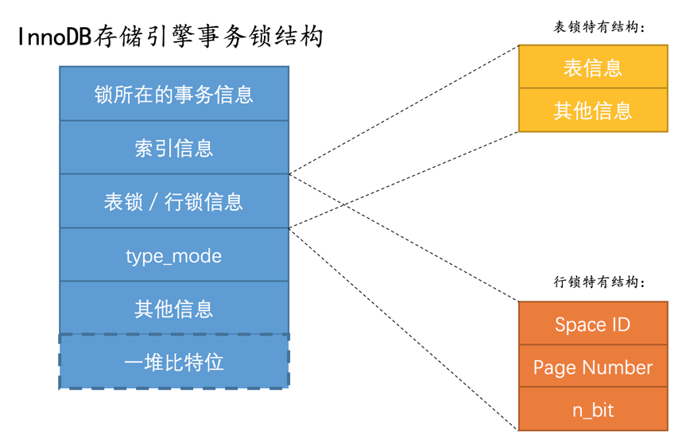
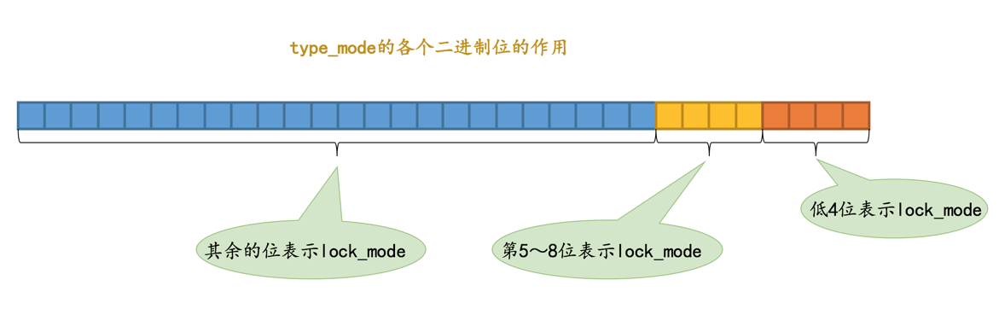

我们前边说对一条记录加锁的本质就是在内存中创建一个 **锁结构** 与之关联，那么是不是一个事务对多条记录加锁，就要创建多个 **锁结构** 呢？比方说事务 T1 要执行下边这个语句：

```
# 事务T1
SELECT * FROM hero LOCK IN SHARE MODE;
```

很显然这条语句需要为 `hero` 表中的所有记录进行加锁，那是不是需要为每条记录都生成一个 **锁结构** 呢？其实理论上创建多个 **锁结构** 没问题，反而更容易理解，但是谁知道你在一个事务里想对多少记录加锁呢，如果一个事务要获取10000条记录的锁，要生成10000个这样的结构也太亏了吧！所以设计 InnoDB 的大叔本着勤俭节约的传统美德，决定在对不同记录加锁时，如果符合下边这些条件：

- 在同一个事务中进行加锁操作
- 被加锁的记录在同一个页面中
- 加锁的类型是一样的
- 等待状态是一样的

那么这些记录的锁就可以被放到一个 **锁结构** 中。当然，这么空口白牙地说有点儿抽象，我们还是画个图来看看 InnoDB 存储引擎中的 **锁结构** 具体长啥样吧：

我们看看这个结构里边的各种信息都是干嘛的：
1. **锁所在的事务信息**：
  不论是 表锁 还是 行锁，都是在事务执行过程中生成的，哪个事务生成了这个 锁结构，这里就记载着这个事务的信息。
  
    小贴士： 实际上这个所谓的“锁所在的事务信息”在内存结构中只是一个指针而已，所以不会占用多大内存空间，通过指针可以找到内存中关于该事务的更多信息，比方说事务id是什么。下边介绍的所谓的“索引信息”其实也是一个指针。

2. **索引信息**：

  对于 行锁 来说，需要记录一下加锁的记录是属于哪个索引的。

3. **表锁 / 行锁信息：**

表锁结构 和 行锁结构 在这个位置的内容是不同的：
- 表锁：
记载着这是对哪个表加的锁，还有其他的一些信息。

- 行锁：
记载了三个重要的信息：

  - Space ID：记录所在表空间。
  - Page Number：记录所在页号。
  - n_bits：对于行锁来说，一条记录就对应着一个比特位，一个页面中包含很多记录，用不同的比特位来区分到底是哪一条记录加了锁。为此在行锁结构的末尾放置了一堆比特位，这个 n_bits 属性代表使用了多少比特位。

小贴士： 并不是该页面中有多少记录，n_bits属性的值就是多少。为了让之后在页面中插入了新记录后也不至于重新分配锁结构，所以n_bits的值一般都比页面中记录条数多一些。

4. **type_mode:**
这是一个32位的数，被分成了`lock_mode` 、`lock_type` 和`rec_lock_type` 三个部分，如图所示：


**锁的模式（lock_mode）**
占用低4位，可选的值如下：
- LOCK_IS（十进制的0）：表示共享意向锁，也就是IS锁。
- LOCK_IX（十进制的1）：表示独占意向锁，也就是IX锁。
- LOCK_S（十进制的2）：表示共享锁，也就是S锁。
- LOCK_X（十进制的3）：表示独占锁，也就是X锁。
- LOCK_AUTO_INC（十进制的4）：表示AUTO-INC锁。

**小贴士**：在InnoDB存储引擎中，LOCK_IS、LOCK_IX、LOCK_AUTO_INC都算是表级锁的模式，LOCK_S和LOCK_X既可以算是表级锁的模式，也可以是行级锁的模式。

**锁的类型（lock_type）**
占用第5～8位，不过现阶段只有第5位和第6位被使用：
- LOCK_TABLE（十进制的16），也就是当第5个比特位置为1时，表示表级锁。
- LOCK_REC（十进制的32），也就是当第6个比特位置为1时，表示行级锁。

**行锁的具体类型（rec_lock_type）**
使用其余的位来表示。只有在lock_type的值为LOCK_REC时，也就是只有在该锁为行级锁时，才会被细分为更多的类型：
- LOCK_ORDINARY（十进制的0）：表示next-key锁。
- LOCK_GAP（十进制的512）：也就是当第10个比特位置为1时，表示gap锁。
- LOCK_REC_NOT_GAP（十进制的1024）：也就是当第11个比特位置为1时，表示正经记录锁。
- LOCK_INSERT_INTENTION（十进制的2048）：也就是当第12个比特位置为1时，表示插入意向锁。
- **其他的类型**：还有一些不常用的类型我们就不多说了。

**is_waiting属性**
设计InnoDB的大叔为了不浪费比特位，把is_waiting属性也放到了type_mode这个32位的数字中：
- LOCK_WAIT（十进制的256）：也就是当第9个比特位置为1时，表示is_waiting为true，也就是当前事务尚未获取到锁，处在等待状态；当这个比特位为0时，表示is_waiting为false，也就是当前事务获取锁成功。