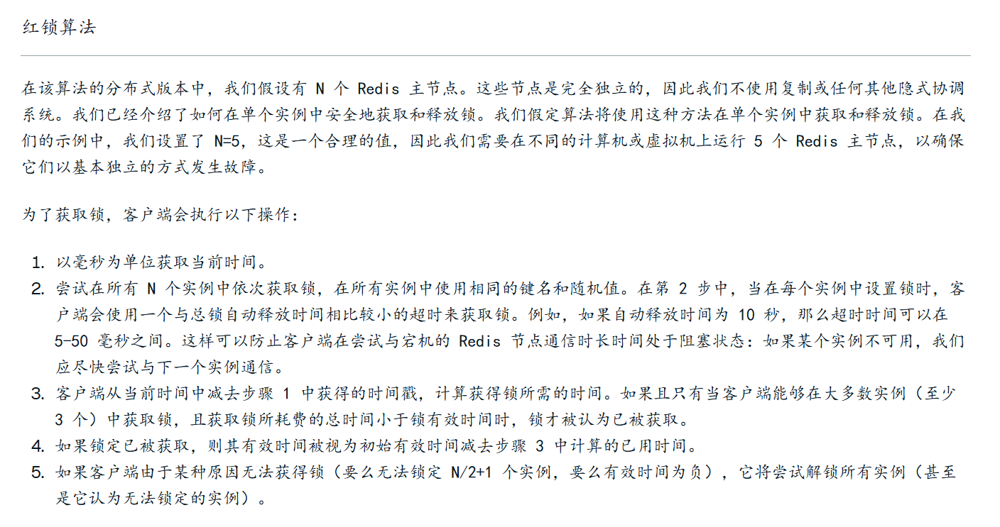

# Redis 分布式锁

这次我采用的是从 0 到 1 推进的方式回答，即通过层层递进完成 Redis 分布式锁的

### 什么是分布式锁？

在计算机领域，锁可以理解为针对某项资源使用权限的管理，它通常用来控制共享资源，比如一个进程内有多个线程竞争一个数据的使用权，解决方式之一就是加锁。
分布式锁，顾名思义，分布式就是分布式场景下的锁，比如多台不同机器上的进程，去竞争同一项资源，就是分布式锁。

### 分布式锁有哪些特性？

具备哪些特性的分布式锁才是一个优秀的分布式锁？我认为要从如下几方面来看：

- **互斥性**：锁的目的是获取资源的使用权，所以只让一个竞争者持有锁，这一点要尽可能保证；
- **抗死锁性**：避免锁因为异常永远不被释放。当一个竞争者在持有锁期间内，由于意外崩溃而导致未能主动解锁，其持有的锁也能够被兜底释放，并保证后续其它竞争者不能加锁；
- **对称性**：同一个锁，加锁和解锁必须是同一个竞争者。不能把其他竞争者持有的锁给释放了。
- **可靠性**：需要有一定程度的异常处理能力、容灾能力。

### 分布式锁的常用方式

分布式锁，一般会依托第三方组件来实现，而利用 Redis 实现则是工作中应用最多的一种。
今天，就让我们从最基础的步骤开始，依照分布式锁的特性，层层递进，步步完善，将它优化到最优，让大家完整地了解如何使用 Redis
来实现一个分布式锁。

#### 最简化版本

首先，当然是搭建一个最简单的实现方式，直接用 Redis 的 setnx 命令，这个命令的语法是：setnx key value，如果 key 不存在，则会将
key 设置为 value，并返回 1；如果 key 存在，不会有任何影响，返回 0。
基于这个特性，我们就可以用 setnx 实现加锁的目的：通过 setnx 加锁，加锁之后其他服务无法加锁，用完之后，再通过 delete 解锁，深藏功与名。

#### 支持过期时间

最简化版本有一个问题：如果获取锁的服务挂掉了，那么锁就一直得不到释放，就像石沉大海，杳无音信。所以，我们需要一个超时来兜底。
Redis 中有 expire 命令，用来设置一个 key 的超时时间。但是 setnx 和 expire 不具备原子性，如果 setnx 获取锁之后，服务挂掉，依旧是泥牛入海。
很自然，我们会想到，set 和 expire，有没有原子操作？
当然有，Redis 早就考虑到这种场景，推出了如下执行语句：set key value nx ex secondsnx 表示具备 setnx 特性，ex
表示增加了过期时间，最后一个参数就是过期时间的值。
能够支持过期时间,目前这个锁基本上是可以用了。但是存在一个问题：会存在服务A 释放掉服务B的锁的可能。

#### 加上 owner

我们来试想一下如下场景：服务 A 获取了锁，由于业务流程比较长，或者网络延迟、GC 卡顿等原因，导致锁过期，而业务还会继续进行。这时候，业务
B 已经拿到了锁，准备去执行，这个时候服务 A
恢复过来并做完了业务，就会释放锁，而真实的分布式场景中，可能存在几十个竞争者，那么上述情况发生概率就很高，导致同一份资源频繁被不同竞争者同时访问，分布式锁也就失去了意义。
基于这个场景，我们可以发现，问题关键在于，竞争者可以释放其他人的锁。那么在异常情况下，就会出现问题，所以我们要进一步的给出解决方案：分布式锁需要满足谁申请谁释放原则，不能释放别人的锁，也就是说，分布式锁，是要有归属的。

#### 引入 Lua

加入 owner 的版本可以称得上是完善的了吗？还有没有什么隐患呢？
这里也不卖关子了，到这一步其实还存在一个问题，我们完整的流程是竞争者获取锁执行任务，执行完毕后检查锁是不是自己的，最后进行释放。
流程一梳理，你们肯定明白了，执行完毕后，检查锁，再释放，这些操作不是原子化的。
可能锁获取时还是自己的，删除时却已经是别人的了。这可怎么办呢？
Redis 可没有直接提供这种场景原子化的操作。遇事不要慌，仔细想一想，Redis 是不是还有个特性，专门整合原子操作，对，就是它——Lua。
Redis + Lua，可以说是专门为解决原子问题而生。
有了 Lua 的特性，Redis 才真正在分布式锁、秒杀等场景，有了用武之地，下面便是改造之后的流程：

### 可靠性

分布式锁的四大特性，眼下可靠性没有解决
面对一些异常场景，包括 Redis 挂掉了、业务执行时间过长、网络波动等情况，我们来一起分析如何处理：
一般来说，有两种方式：主从容灾和多级部署。

#### 最简单的

最简单的一种方式，就是为 Redis 配置从节点，当主节点挂了，用从节点顶包。
但是主从切换，需要人工介入，会提高人力成本。不过 Redis 已经有成熟的解决方案，也就是哨兵模式，可以灵活自动切换，不再需要人工介入。
通过损失部分数据，分布式虽然一定程度解决了单点的灾难问题，但却不是尽善尽美的。由于同步有时延，Slave
可能会损失部分数据，虽然这在一些场景下是可以接受的，但在对一致性要求高的场景中，这就是不可接受的了。

#### 多机部署

如果对一致性的要求高一些，可以尝试多机部署，比如 Redis 的 Redlock。大概的思路是客户端会向多个 Redis
节点尝试加锁，基本保证它们不会同时宕掉，在获取到 CD 释放锁的过程中，客户端会执行以下操作：

1. 只命令过半 Redis 申请加锁，Redis 返回成功，那么就是获取到了锁。如果超过一半失败，需要向每个 Redis 发送解锁命令。
2. 只要超过一半，也就是 3 个 Redis 返回成功，那么就是获取到了锁。如果超过一半失败，需要向每个 Redis 发送解锁命令。
3. 由于向多个 Redis 发送请求，会有一定时延，所以取持有时间，需要减去请求时间。这个可以作为判断依据，如果剩余时间已经为
   0，那么就会获取锁失败；所以
4. 使用完成后，记得向所有 Redis 发送解锁请求。

### 总结

我们围绕互斥性、安全性、对称性层层递进，实现了一个 Redis 分布式锁。这个架构在十分场景下其实是够用的，当然需要注意，
没点就是 RedisLock 这种比较重的方案，在生产中其实用得多，本身就不能完全可靠，业务上又基本做了幂等，没必要搞那么复杂。

## redLock


伪代码

```java
function acquireDistributedLock(key, ttl, retryTimeout):
    value = generateRandomValue()
    successCount = 0
    startTime = currentTimeMillis()

    for each redisInstance in redisInstances:
        try:
            result = redisInstance.set(key, value, NX, PX=ttl, timeout=retryTimeout)
            if result == OK:
                successCount += 1
        catch:
            continue  // 如果该实例不可用，跳过

    elapsedTime = currentTimeMillis() - startTime

    if successCount >= (totalInstances / 2 + 1) AND elapsedTime < ttl:
        return value  // 成功获取锁
    else:
        // 获取锁失败，清理已加的部分锁
        for each redisInstance in redisInstances:
            if redisInstance.get(key) == value:
                redisInstance.delete(key)
        return null

```

并**不是 Redis 本身提供了 `timeout` 这个参数**。

`timeout=retryTimeout` 是客户端（比如 Jedis、Lettuce、Redisson）设置的**socket 超时 / 连接超时参数**。
意思是最多等待这个Redis 实例响应30S,否则跳过这个节点。

<details>
<summary>📌 Redis 主从和集群区别</summary>
<div style="background:#f8f9fa; padding:10px; border-left:4px solid #4285f4; margin-top:8px;">
<p>主从结构 强调<strong>数据复制与读写分离</strong>，其核心目的是<strong>高可用</strong>；</p>
<p>而 Redis Cluster 的核心在于<strong>数据分片与自治故障转移</strong>，其目的是<strong>横向扩展和 容错性。</strong></p>
</div>
</details>
