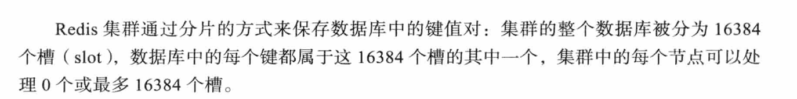

# 基本概念

> 问题1: 如果有5个节点,这些节点平分槽位吗?

Redis 集群的核心机制是将整个键空间映射到16384个哈希槽（hash slots），并由各主节点分别承载一段槽的映射关系。若你有 **5 个主节点**，官方 `redis-cli --cluster create` 工具在初始化时会按下述方式尽量均衡分配：每个节点获得 ⌊16384÷5⌋=3276 个槽，剩余的 16384−3276×5=4 个槽则分别再各分配给 4 个节点——因此，最终有 4 个节点各持有 3277 个槽，1 个节点持有 3276 个槽，节点间的差异最多为 1。
