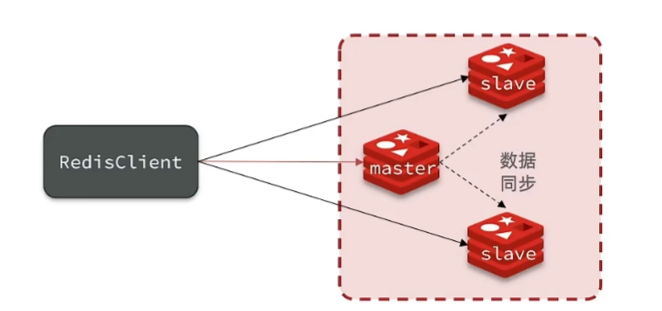
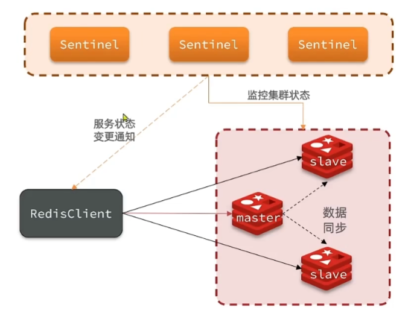
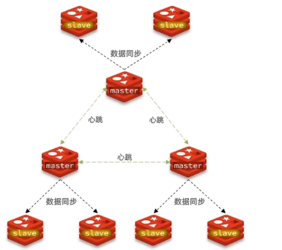

# 基本概念

## 分片

> 问题1: 如果有5个节点,这些节点平分槽位吗?

Redis 集群的核心机制是将整个键空间映射到16384个哈希槽（hash slots），并由各主节点分别承载一段槽的映射关系。若你有 **5 个主节点**，官方 `redis-cli --cluster create` 工具在初始化时会按下述方式尽量均衡分配：每个节点获得 ⌊16384÷5⌋=3276 个槽，剩余的 16384−3276×5=4 个槽则分别再各分配给 4 个节点——因此，最终有 4 个节点各持有 3277 个槽，1 个节点持有 3276 个槽，节点间的差异最多为 1。

## Redis 主从 ->  Sentinel -> Cluster

### 主从复制模式

在最初的 Redis 架构中，采用 **主从复制**，
即一个主节点负责写操作，多个从节点负责读操作。该模式通过 **读写分离** 提升了读性能，
并且通过复制保证了数据的冗余备份。但存在 **主节点故障时无法自动切换**、**从节点延迟** 和 **单点写入瓶颈** 等问题，难以满足对高可用和大规模扩展的需求。

### Sentinel 模式

为了解决主从模式下的故障切换和监控问题，Redis 引入了 **Sentinel 模式**。Sentinel 负责 **监控** 各节点状态、
**故障检测**、**自动故障转移** 以及 **通知**。当主节点不可用时，
Sentinel 会在从节点中选举新的主节点，并自动重配置其他从节点指向新主，保证服务的 **持续可用性**。

**局限性**

虽然 Sentinel 弥补了主从模式的自动切换不足，但仍然保留了 **单主写入** 的瓶颈，无法进行 **数据分片**，因此在 **水平扩展** 
方面依旧受限。此外，Sentinel 本身也需依赖多数投票来选举故障节点，存在一定的 **配置与维护复杂度**。

### Cluster 模式

为了解决大规模场景下的读写扩展和高可用需求，Redis 推出了 **Cluster 模式**。Cluster 通过 **哈希槽** 将数据分散到多个节点，
实现 **自动分片**，从而支持 **多主并行写入**。同时，每个分片内部仍采用主从复制，结合 **集群自动故障转移**，保证了节点故障时的服务可用性与数据安全。

**优势与适用场景**

Redis Cluster 在 **线性扩展能力** 和 **故障隔离** 方面表现出色：新增或移除节点时只需迁移部分哈希槽，业务可在线不中断；
节点故障只影响对应分片，降低了故障影响范围。它适用于 **大规模、高并发**、需要 **低延迟读写** 和 **高可用保障** 的生产环境。

**演变驱动因素**
整体来看，Redis 从 **主从复制** 到 **Sentinel** 再到 **Cluster**，是为了逐步解决 **自动化运维**、**高可用故障切换**，
以及 **水平扩展** 的关键需求。每一代模式都针对前一代的 **单点瓶颈** 或 **运维复杂度** 进行了优化，最终形成了能够支持 **海量数据存储与高并发访问** 的分布式解决方案。
