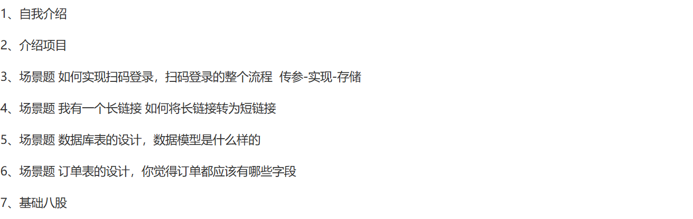
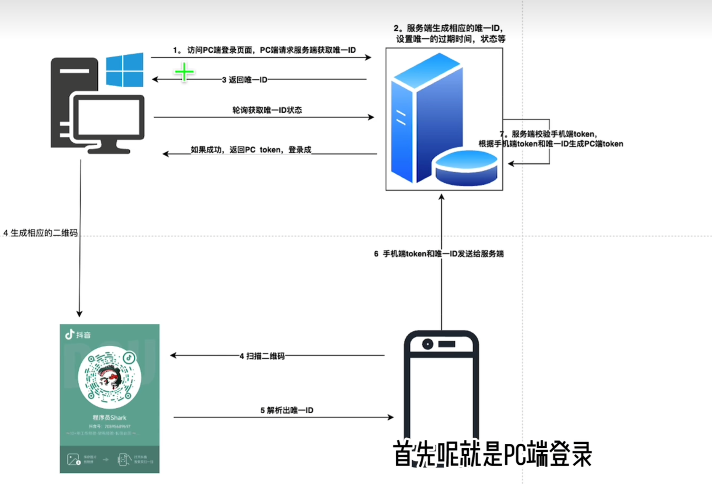

# ，🚀 哈啰一面真题

---

    

        题目来源
    

    <a href="https://www.nowcoder.com/discuss/741702922861314048?sourceSSR=search" 
       target="_blank"
       style="
           color: #4f46e5;
           text-decoration: none;
           font-weight: 500;
           display: inline-block;
           margin-top: 0.5rem;
       ">
        🔗 牛客网原帖链接
    </a>

    

        

            <svg width="20" height="20" viewBox="0 0 24 24" fill="#6366f1">
                <path d="M12 2C6.48 2 2 6.48 2 12s4.48 10 10 10 10-4.48 10-10S17.52 2 12 2zm1 15h-2v-6h2v6zm0-8h-2V7h2v2z"/>
            </svg>
        

        <h3 style="margin:0;color:#1e293b;">题目内容</h3>
    

    

        
        
题目截图

    

## 扫码登录

手机扫码之后，PC 端如何获得认证后的token?

手机经过扫描二维码，解码的过程，获取其实二维码的内容

扫描涉及到三个端，手机端、PC 端、服务器 三者

**PC与服务器**

1. 点击扫描登录，PC 端向服务器发送生成二维码的需求
2. 服务器 返回二维码内容，里面有唯一ID：还需要有状态(未扫描|扫描成功|已失效)，正好可以把唯一ID 作为key，存入redis。设置一个失效时间

**手机与PC**

手机扫描，服务端返回给PC 端唯一的ID，手机会显示确认登录的按钮。手机端会将唯一ID 和手机认证 的token 发送到服务端进行认证。验证tOken 是否有效 ，

- 有效：验证唯一ID 状态

  - 不存在，失效
  - 存在。未扫码。redis 中存在唯一ID 作为key ,但是value 是 null, 生成PC 端的token ,与唯一ID 进行关联。redis 中唯一ID 的这个key 的值为PC 端的token。

    服务器如何把这个PC 的token 带回 PC 端呢？

  PC 端在生成 二维码之后，会启动一个异步请求，向服务器去查询这个唯一ID 的状态

  - redis 中存在唯一ID 的key, value 是null,说明二维码是有效的 => 没有扫描
  - redis 中没有 key => 失效
  - redis 中 有唯一ID ，且不为null => 成功，

  返回成功，并返回关联的token

**PC 端是通过什么方式 查询 服务器 redis 中唯一ID 状态**？

1. 轮询
2. 长轮询
   
3. PC 端访问到了 登录界面，点击扫描登录，PC 端请求服务端获取唯一ID,
4. 服务器生成相应的唯一ID，设置唯一的过期时间、状态等
5. 服务器返回唯一ID，
6. PC 端根据这个唯一ID 生成对应的二维码。(挖个坑) 手机扫描二维码。返回唯一ID
7. 手机端(<mark>处于已经登录的状态</mark>)将 手机端token 和 唯一ID 发送给 服务端。
8. 服务器校验 手机端token，根据手机端token 和唯一ID  生成PC 端的token。

服务器如何把 PC 端的token 返回给PC 端的?

在 PC 端生成对应的二维码之后，PC 端 会发起一个异步请求，轮询去获取唯一ID 的状态。如果成功，返回PC token

## 长链接转短链接

1. **短链接的作用**

* **缩短 URL**：在短信营销等场景下，一条短信最多 70 字，长 URL 会导致超出收费两条短信，短链接可有效节省字符数。
* **安全性隔离**：短链接本身不携带原始 URL 的参数信息，避免在浏览器地址栏暴露敏感参数。
* **时效性需求**：营销活动等场景可生成带过期时间的短链（如一个月后自动失效），便于回收 ID 资源。

2. **短链接算法的选择**

* **不可直接用 MD5**：MD5 32 位摘要过长，不符合短链长度要求。
* **时间戳＋自增序列（初步方案）**

  * 前若干位编码自上线以来的时间戳（62 进制），后若干位作每秒自增序列，理论每秒可产出数千个 ID；
  * 问题在于：长时间运行后时间戳占位不足，以及并发环境下序列冲突须借助分布式锁（etcd/Redis）等，复杂度高且 ID 空洞浪费严重。
* **数据库自增 ID**（最终方案）

  * 直接用数据库的 int64 自增主键，将自增值转换为 62 进制字符串；
  * 从 1 位、2 位...逐渐增长，到达可接受的最大位长后再换域名继续使用；
  * 简单可靠，无需额外分布式锁，也避免了空洞浪费。

3. **缓存方案**

* **缓存读写分离**：短链映射关系写入数据库后一次写入缓存（如 Redis），后续全部走缓存。
* **热点数据加载**

  1. **启动时主动加载**：根据最近访问时间（如近 30 天）预加载热点短链到缓存；
  2. **运行时被动懒加载**：缓存未命中时回源数据库加载并写入缓存；
  3. **动态过期**：缓存条目默认 30 天，访问时重置过期时间，常访问的热点数据始终保留。
* **防止缓存穿透**：在缓存之外维护当前最大自增 ID，首次查询时比对短链是否可能存在，若超范围则直接返回，避免无效请求打穿缓存和数据库。

### 为什么时间戳＋自增序列方案不行？

**1. 时间戳位不足**

* **位数有限**：假设我们在 6 位 ID 中用前 4 位来编码时间戳（Base‑62），剩下 2 位做序列号。
* **最大可表示的“秒数”有限**：4 位 Base‑62 最多能表示 大概 170 天, 这表示超过“时间窗口”就溢出：
如果你把系统上线就当做 t=0 开始计数， 170 天后再生成短链，就没法再把当前时间戳装进那 4 位里了——要么就变成溢出覆盖，
要么就得扩大 ID 长度，或者“换域名”重置计数。

**2. 并发下的序列冲突**
- 序列号冲突：后面 2 位 Base‑62 能表示的序号是 62*62 = 3844,如果一秒内并发请求超过这个阈值，就会产生序号重复。

**3. ID 空洞浪费严重**
预分配 vs 按需：哪怕你一秒内只生成 10 条短链，剩下的 ~3,834 个序号都被“预留”出去了，但永远不会再被用上，造成 ID 空洞。

