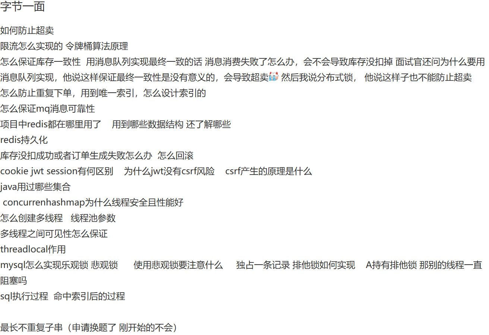

# 🚀 字节跳动一面真题
----

    

        题目来源
    

    <a href="https://www.nowcoder.com/feed/main/detail/fa191679038f4646afacac35a91c554c?sourceSSR=search" 
       target="_blank"
       style="
           color: #4f46e5;
           text-decoration: none;
           font-weight: 500;
           display: inline-block;
           margin-top: 0.5rem;
       ">
        🔗 牛客网原帖链接
    </a>

    

        

            <svg width="20" height="20" viewBox="0 0 24 24" fill="#6366f1">
                <path d="M12 2C6.48 2 2 6.48 2 12s4.48 10 10 10 10-4.48 10-10S17.52 2 12 2zm1 15h-2v-6h2v6zm0-8h-2V7h2v2z"/>
            </svg>
        

        <h3 style="margin:0;color:#1e293b;">题目内容</h3>
    

    

        
        
题目截图

    

## 1. 如何防止超卖
**解决超卖问题**：高并发下将数据存于 Redis 可能产生超卖，即库存只有十个却卖了二十个。要解决超卖需保证精确计数，原因是秒杀时用户操作分两步，先判断
Redis 商品库存名额是否充足，充足则扣减库存，若这两步非原子性，高并发下会出问题，可能导致实际库存高于 Redis 内存库存。解决办法是每个请求用
Lua 脚本，**先判断库存名额是否充足再扣减**，保证这两个操作是原子性的，要么都成功，要么都失败。
> 问题一：
>
> 在实际应用中，Lua 脚本在 Redis 中执行原子性操作时，如何处理脚本执行失败的情况？比如网络波动导致脚本执行中断，你会采取什么措施来确保库存的一致性？

答：处理 Lua 脚本执行中因网络波动等原因中断的问题，关键在于**保证操作的幂等性和建立完善的重试与补偿机制**。

1. 我会为每个扣库存请求生成**唯一 ID**，并在 Lua 脚本中增加逻辑：**先检查此 ID 是否已处理**
   ，如果已处理则直接返回成功，否则才执行库存检查和扣减，并在成功后记录该 ID。这样客户端即使在网络中断后用相同 ID
   重试，也不会重复扣减库存。

2. 此外，我们还需要后台补偿机制，比如对超时未完成支付的预留库存进行自动释放（库存回补），以及定期的库存对账流程，来确保最终的数据一致性。配合
   Redis 的持久化和高可用部署，可以最大限度地保证在高并发场景下库存数据的准确。”

## 2. MQ 消息的可靠性

1. 生产者到消息队列之间有一个消息确认机制。
2. 消息接收到了在消息队列中，做一个消息的持久化，防止MQ 宕机
3. 消息队列到消费者之间存在消息确认机制。来保证消息成功被消费，这里需要注意消息消费的幂等问题

消息可靠性可以通过下面这些方式来保证：

* **消息持久化**：确保消息队列能够持久化消息是非常关键的。在系统崩溃、重启或者网络故障等情况下，未处理的消息不应丢失。例如，像
  RabbitMQ 可以通过配置将消息持久化到磁盘，通过将队列和消息都设置为持久化的方式（设置 `durable = true`
  ），这样在服务器重启后，消息依然可以被重新读取和处理。
* **消息确认机制**
  ：消费者在成功处理消息后，应该向消息队列发送确认（acknowledgment）。消息队列只有收到确认后，才会将消息从队列中移除。如果没有收到确认，消息队列可能会在一定时间后重新发送消息给其他消费者或者再次发送给同一个消费者。以
  Kafka 为例，消费者通过 `commitSync` 或者 `commitAsync` 方法来提交偏移量（offset），从而确认消息的消费。
* **消息重试策略**：当消费者处理消息失败时，需要有合理的重试策略。可以设置重试次数和重试间隔时间。例如，在第一次处理失败后，等待一段时间（如
  5 秒）后进行第二次重试，如果重试多次（如 3 次）后仍然失败，可以将消息发送到死信队列，以便后续人工排查或者采取其他特殊处理。

## 3. 消息丢失怎么解决的？

RabbitMQ 消息丢失可能发生在生产者、Broker（RabbitMQ 服务器）和消费者三个环节，需要针对性地采取措施来确保消息的可靠性。解决消息丢失问题通常需要综合运用多种机制。

首先，在**生产者端**，需要确保消息成功发送到了 Broker。主要通过 **Publisher Confirms（发布者确认）机制**来实现。开启此机制后，Broker
收到消息会给生产者发送一个确认（ack），如果消息未能成功到达 Broker（例如网络问题或 Broker
故障），生产者会收到一个否定确认（nack）或超时，从而可以进行重试或记录错误。对于无法路由到任何队列的消息，可以配合使用**Publisher Returns（发布者退回）机制**，让 Broker 将这些消息退回给生产者处理。

其次，在 **Broker 端**，需要保证即使 Broker 重启或崩溃，消息也不会丢失。这主要依赖于**持久化**。需要同时设置两点：一是将
**队列（Queue）声明为持久化** (`durable=true`)，这样 Broker 重启后队列依然存在；二是将**消息（Message）标记为持久化** (
`delivery_mode=2`)，这样 Broker 会将消息写入磁盘。只有两者都设置，消息才能在 Broker 重启后恢复。需要注意的是，持久化会带来一定的性能开销。

然后，在**消费者端**，需要确保消息被正确处理后才从队列中移除。默认的自动确认（auto-ack）模式下，消息一旦被投递给消费者就会立即被标记为删除，如果此时消费者处理失败或崩溃，消息就会丢失。因此，必须采用
**手动确认（Manual Acknowledgement）模式**。消费者在成功处理完消息后，显式地调用 `basic.ack` 方法告知 Broker，Broker
才会将消息从队列中删除。如果处理失败，可以调用 `basic.nack` 或 `basic.reject` 来拒绝消息，选择是否让其重新入队。

最后，为了进一步提高可用性并减少单点故障导致的消息丢失风险，可以部署 **RabbitMQ 集群**，并对关键队列启用**镜像（Mirroring）**
。镜像队列会将消息副本同步到集群中的多个节点。当主节点故障时，可以从镜像节点恢复消息，但这主要解决的是 Broker
物理故障或网络分区导致的数据丢失问题，是对上述持久化和确认机制的补充。

## 4. cookie jwt session 区别, 为什么 JWT 没有csrf 风险
### Cookie
`Cookie` 本质上是服务器发送到用户浏览器并保存在本地的一小块数据，浏览器在后续对该服务器的请求中会自动将其带回。它的设计初衷是存储少量非敏感信息，如用户偏好设置或跟踪标识。将完整的、敏感的账户信息直接存储在
Cookie 中是一种必须避免的反模式，因为它将安全凭证暴露在客户端，极易受到跨站脚本（XSS）攻击窃取或被用户本地篡改。在认证场景下，Cookie
更常见的、相对安全的用途是作为承载 Session ID 或有时是 JWT 的载体。为了增强安全性，应始终为承载敏感标识符的 Cookie 设置
`HttpOnly`（防止脚本访问）、`Secure`（仅通过 HTTPS 传输）和 `SameSite`（缓解 CSRF 攻击）属性。
### Session
Session 机制是一种典型的服务端状态管理方案。用户首次认证成功后，服务器创建一个 Session 对象存储用户相关信息（如用户
ID、角色等），并将这个 Session 对象与一个唯一的 Session ID 关联起来。此 Session ID 通常通过设置一个 Cookie
发送给客户端。后续请求中，客户端只需通过 Cookie（或其他约定方式）回传此 Session ID，服务器便能据此查找对应的 Session
数据，从而识别用户并恢复其状态。这种方式的主要优势在于敏感的用户信息保留在服务端，提高了安全性（相对于直接在 Cookie
中存储敏感信息而言）。然而，必须强调 Session ID 本身就是一种临时的、代理性质的凭证，一旦泄露，攻击者即可冒充用户，因此 Session
ID 的传输和存储必须得到充分保护。Session 机制的主要挑战在于其状态性：服务器需要为每个活跃用户维护 Session
数据，这会消耗服务器内存或存储资源。在分布式或无服务（Serverless）架构下，简单的内存 Session
会失效，因为用户的后续请求可能被路由到不同的服务器实例。这通常需要引入集中式的 Session 存储（如 Redis、Memcached
或数据库），增加了系统的复杂性和依赖。
### JWT
JWT（JSON Web Token）则提供了一种无状态（Stateless）的认证和授权机制。用户认证成功后，服务器根据用户信息（Payload）、一个密钥以及指定的签名算法（如
HMAC SHA256 或 RSA）生成一个紧凑且自包含的 Token。这个 Token
包含了所有必要的用户身份信息（Claims），并且由于有签名，其内容可以被服务器验证其真实性和完整性，防止篡改。客户端通常将 JWT
存储在本地（如 Local Storage 或 Session Storage，有时也放在 Cookie 中），并在每次请求时通过 `Authorization: Bearer <token>`
HTTP 头部发送给服务器。服务器收到 Token 后，只需使用密钥验证签名即可确认用户身份，无需查询任何服务端的 Session 存储。这使得
JWT 天然适合分布式系统和微服务架构，因为它极大地提升了系统的可伸缩性和解耦性。然而，JWT 的主要缺点在于其无状态特性带来的管理难题：一旦签发，Token
在其有效期（`exp` 声明）内通常是有效的，服务器无法轻易地将其“撤销”或使其提前失效。如果 Token
泄露，攻击者可以在其过期前一直使用。缓解策略包括设置较短的有效期、使用刷新 Token（Refresh Token）机制、维护一个 Token
黑名单（但这又引入了状态，一定程度上违背了 JWT 的初衷）等。此外，JWT 的 Payload 默认是 Base64Url 编码而非加密，因此不应在
Payload 中存放高度敏感的信息，除非对 JWT 本身进行加密（形成 JWE）。

### CSRF
跨站请求伪造（CSRF）的核心在于利用了浏览器在处理跨域请求时的一个特定行为：对于某些类型的认证凭证（主要是Cookie），浏览器会自动将其附加到发往目标域名的请求中，
无论这个请求是由哪个源头发起的。传统的基于Session ID的认证机制通常将Session ID存储在Cookie中，浏览器会自动管理这些Cookie。当用户登录站点A后，
浏览器存储了站点A的Session Cookie。 此时，如果用户访问了恶意站点B，站点B可以通过HTML标记或脚本诱导用户的浏览器向站点A发送一个伪造的请求（例如，修改用户邮箱地址）。
由于浏览器会自动携带站点A的有效Session Cookie，站点A的服务器会认为这是一个合法的用户操作，从而执行该请求，导致攻击成功。这里的关键在于凭证（Cookie）的**自动、隐式提交**。
### JWT 没有csrf 风险?
相比之下，JWT（JSON Web Tokens）通常能够规避这种典型的CSRF风险，但这并非JWT技术本身的固有属性，而是源于其**推荐和常见的使用模式**。
JWT通常不依赖浏览器自动管理的Cookie进行传输。最常见的做法是将JWT存储在客户端的`localStorage`或`sessionStorage`中，并在每次向服务器发送请求时，
通过JavaScript代码**显式地**读取该Token，并将其放入HTTP请求的`Authorization`头部（通常使用`Bearer`模式）。由于以下原因，这种模式天然地防御了传统CSRF：

1.  **非自动发送**：存储在`localStorage`或`sessionStorage`中的数据不会被浏览器自动附加到任何请求中。必须由客户端脚本主动读取并添加到请求里。
2.  **同源策略限制**：恶意站点B的脚本无法直接读取或访问用户浏览器中存储的属于站点A域下的`localStorage`或`sessionStorage`数据。因此，站点B无法获取到JWT。
3.  **无法伪造`Authorization`头**：站点B发起的跨域请求无法轻易地为发往站点A的请求添加一个包含有效JWT的`Authorization`头。 浏览器发送的简单跨域请求（如通过``或简单`<form>`）不会包含自定义头部，而复杂的跨域请求（需要添加`Authorization`头）会受到浏览器的CORS（跨源资源共享）策略的预检（OPTIONS请求）限制。除非站点A的服务器配置允许来自站点B的跨域请求携带`Authorization`头，否则请求将被浏览器阻止。

然而，必须强调，如果开发者选择将JWT存储在**标准Cookie**中（而不是`localStorage`等），并且没有采取额外的CSRF防护措施（如设置Cookie的`SameSite=Strict`或`SameSite=Lax`属性，
或者使用同步令牌模式/CSRF Token），那么基于JWT的认证机制将**同样面临CSRF风险**，其原理与基于Session Cookie的CSRF攻击完全一致。因此，JWT的CSRF安全性并非绝对，而是取决于其存储和传输的具体策略。认为JWT本身就能完全杜绝CSRF是一种常见的误解。正确的实践，即通过`Authorization`头传输存储在非Cookie位置的JWT，才是其能够有效防御传统CSRF攻击的原因。

## 5. `concurrentHashMap` 为什么线程安全且性能好?
`ConcurrentHashMap` 在 JDK 1.8 及以后版本，其线程安全和高性能的核心在于采用了**分段锁思想的演进**，结合了 `synchronized` 和 CAS（Compare-and-Swap）操作，实现了更细粒度的并发控制。它摒弃了早期版本（JDK 1.7）的 `Segment` 数组，直接使用类似 `HashMap` 的 Node 数组（或 `TreeNode` 红黑树）结构，但并发控制策略更为精妙。

1. 它的线程安全主要通过**锁住哈希桶的头节点**来实现。当需要对某个哈希桶进行写操作（如插入、更新、删除）时，会使用 `synchronized` 关键字锁定该桶的第一个节点。这意味着只有尝试修改**同一个哈希桶**内数据的线程才会产生锁竞争，而对不同哈希桶的操作可以完全并行执行，大大降低了锁的粒度。

2. 对于一些特定的简单写操作，`ConcurrentHashMap` 会优先尝试使用**乐观锁即 CAS 操作**。例如，向一个空桶中添加第一个节点，或者更新某个已存在节点的值时，会尝试通过 CAS 原子地完成，如果成功则避免了使用 `synchronized` 加锁的开销，进一步提升了性能。

3. 这种**细粒度的锁定机制**（锁桶头或 CAS）是其高性能的关键。相比于 `Hashtable` 或 `Collections.synchronizedMap` 对整个数据结构加全局锁的方式，`ConcurrentHashMap` 极大地**减少了锁的竞争范围**。在多核 CPU 环境下，多个线程可以同时安全地对 `ConcurrentHashMap` 的不同部分（不同哈希桶）进行操作，从而显著提高并发环境下的吞吐量。

4. 在**扩容（resizing）** 过程中，`ConcurrentHashMap` 也进行了并发优化。它允许多个线程**协同参与数据迁移**工作，每个线程负责迁移一部分哈希桶。通过 CAS 等机制来协调迁移进度和保证数据一致性，使得扩容过程更加高效，并且在扩容期间，读操作通常不受影响（或影响很小），写操作也仅在迁移特定桶时短暂阻塞。

5. 对于**读操作**（如 `get` 方法），`ConcurrentHashMap` 做了大量优化，大部分情况下**几乎是无锁**的。它利用了 `volatile` 关键字保证节点中关键属性（如 `value` 和指向下一个节点的 `next` 指针）的**内存可见性**。这使得读操作可以快速完成，且不会阻塞写操作，进一步提升了整体的并发性能。
## 6. MySQL 怎么实现乐观锁、悲观锁
悲观锁（Pessimistic Locking）：

- 假设会发生冲突，因此在操作数据之前就对数据加锁，确保其他事务无法访问该数据。常见于对数据一致性要求较高的场景。
- 实现方式：使用行级锁或表级锁，例如可以使用 `SELECT ... FOR UPDATE` 或 `LOCK IN SHARE MODE` 语句来加锁。

乐观锁（Optimistic Locking）：

- 假设不会发生冲突，因此在操作数据时不加锁，而是在更新数据时进行版本控制或校验。如果发现数据被其他事务修改，则会拒绝当前事务的修改，需重新尝试。
- 实现方式：通常通过版本号或时间戳来实现，每次更新时检查版本号或时间戳是否一致。
### 用悲观锁（尤其是 FOR UPDATE）时，需要特别注意以下几点：
1. **性能影响:**
    - **降低并发:** 悲观锁会阻塞其他尝试修改（或根据锁类型读取）相同数据的事务，直到锁被释放。在高并发场景下，这会显著降低系统的吞吐量。锁定的时间越长，影响越大。
    - **资源消耗:** 维护锁本身需要消耗数据库资源。
2. **死锁 (Deadlock):**
    - **风险:** 当两个或多个事务相互等待对方持有的锁时，就会发生死锁。例如，事务A锁定了行1等待行2，而事务B锁定了行2等待行1。
    - **后果:** 死锁发生时，数据库通常会自动检测到，并选择一个事务进行回滚（通常是持有锁较少或事务较小的那个），以打破循环等待。这会导致被回滚的事务失败。
    - 预防/处理:
        - **保持事务简短:** 尽量缩短持有锁的时间。
        - **一致的访问顺序:** 约定所有事务都按相同的顺序访问资源（例如，总是先锁 `accounts` 表再锁 `orders` 表）。
        - **使用较低的隔离级别:** 如果业务允许，降低隔离级别可能减少锁冲突。
        - **锁升级:** 注意避免因索引失效导致行锁升级为表锁，这会大大增加死锁风险和降低并发。确保 `WHERE` 条件能有效利用索引。
        - **设置锁等待超时:** 配置 `innodb_lock_wait_timeout` 参数，让等待超时的事务自动放弃，避免无限期等待。但这只是处理死锁的一种方式，不能完全避免。
        - **应用程序重试:** 捕获死锁错误并进行重试。
3. **必须在事务中使用:**
    - `FOR UPDATE` 或 `LOCK IN SHARE MODE` 需要在事务块 (`BEGIN`/`START TRANSACTION` ... `COMMIT`/`ROLLBACK`) 内才有意义，确保锁能持续到事务结束。
4. **索引的重要性:**
    - 悲观锁的效果和性能**高度依赖于索引**。如果 `SELECT ... FOR UPDATE` 的 `WHERE` 条件没有使用合适的索引，MySQL 可能无法精确地锁定目标行，可能会扫描更多行并锁定它们，甚至在某些情况下（如无法使用索引）会退化为表锁，这对于并发是灾难性的。

## 7. `sql` 执行过程中,命中索引的过程
SQL 查询命中索引的过程始于**查询优化器**。当数据库接收到一条 SQL 查询语句后，查询优化器会对其进行分析，特别是 `WHERE` 子句、`JOIN` 条件等。
优化器的核心任务是评估执行该查询的多种可能路径（执行计划），并选择成本最低、效率最高的一种。如果查询条件涉及的列上存在索引，优化器会评估使用该索引是否比全表扫描或其他方式更优。

优化器**选择是否使用索引以及使用哪个索引**，主要基于**成本估算**。它会利用数据库维护的**统计信息**（如表的行数、列值的分布情况、索引的选择性等）
来预测不同执行计划的 I/O 成本和 CPU 成本。**索引的选择性**（Index Selectivity）是一个关键因素，选择性越高（即索引列的值越不重复，越接近唯一），
通过索引能过滤掉的数据比例就越大，使用索引的优势通常也越明显。

一旦优化器决定使用某个索引（通常是 B-Tree 或 B+ Tree 结构），执行引擎就会开始**遍历该索引结构**。它会根据查询条件中的值（例如 `WHERE id = 100` 中的 `100`），
从索引的根节点开始，逐层向下查找，比较节点中的键值，最终定位到包含目标值的**叶子节点**。这个过程类似于在字典中查找单词，速度远快于逐行扫描整个表。

在索引的叶子节点找到对应的条目后，该条目会包含一个**指向实际数据行的指针**（或称为“书签”）。对于非聚集索引（Non-Clustered Index），这个指针通常是行标识符（如 RowID）；
对于聚集索引（Clustered Index），叶子节点本身就存储了实际的数据行（或指向数据行的主键，具体取决于实现）。

最后一步是**获取数据行**。执行引擎利用从索引叶子节点获取的指针，直接定位到表存储中相应的数据行，并读取查询所需要的列数据。如果查询只需要索引中已包含的列（覆盖索引），
则可能无需回表访问实际数据行，进一步提高效率。这个通过索引定位再获取数据的过程，避免了对大量无关数据的扫描，是索引提高查询性能的核心原因。

