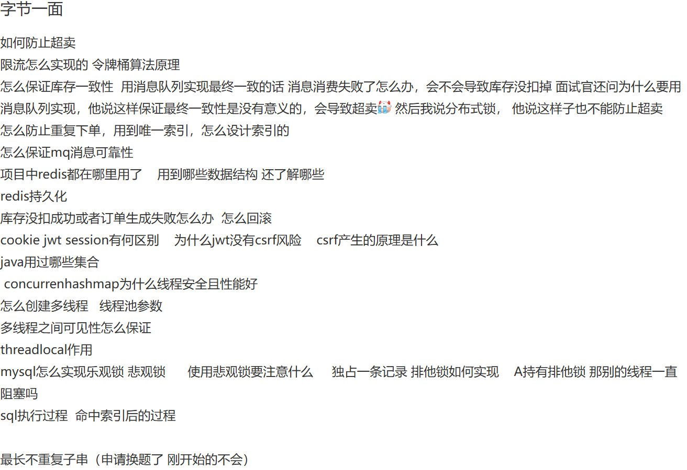

# 字节一面

## 1. 如何防止超卖

**解决超卖问题**：高并发下将数据存于 Redis 可能产生超卖，即库存只有十个却卖了二十个。要解决超卖需保证精确计数，原因是秒杀时用户操作分两步，先判断 Redis 商品库存名额是否充足，充足则扣减库存，若这两步非原子性，高并发下会出问题，可能导致实际库存高于 Redis 内存库存。解决办法是每个请求用 Lua 脚本，**先判断库存名额是否充足再扣减**，保证这两个操作是原子性的，要么都成功，要么都失败。

> 问题一：
>
> 在实际应用中，Lua 脚本在 Redis 中执行原子性操作时，如何处理脚本执行失败的情况？比如网络波动导致脚本执行中断，你会采取什么措施来确保库存的一致性？

答：面试官您好，处理 Lua 脚本执行中因网络波动等原因中断的问题，关键在于**保证操作的幂等性和建立完善的重试与补偿机制**。

1. 我会为每个扣库存请求生成**唯一 ID**，并在 Lua 脚本中增加逻辑：**先检查此 ID 是否已处理**，如果已处理则直接返回成功，否则才执行库存检查和扣减，并在成功后记录该 ID。这样客户端即使在网络中断后用相同 ID 重试，也不会重复扣减库存。

2. 此外，我们还需要后台补偿机制，比如对超时未完成支付的预留库存进行自动释放（库存回补），以及定期的库存对账流程，来确保最终的数据一致性。配合 Redis 的持久化和高可用部署，可以最大限度地保证在高并发场景下库存数据的准确。”

## 2. MQ 消息的可靠性

1. 生产者到消息队列之间有一个消息确认机制。
2. 消息接收到了在消息队列中，做一个消息的持久化，防止MQ 宕机
3. 消息队列到消费者之间存在消息确认机制。来保证消息成功被消费，这里需要注意消息消费的幂等问题

消息可靠性可以通过下面这些方式来保证：

* **消息持久化**：确保消息队列能够持久化消息是非常关键的。在系统崩溃、重启或者网络故障等情况下，未处理的消息不应丢失。例如，像 RabbitMQ 可以通过配置将消息持久化到磁盘，通过将队列和消息都设置为持久化的方式（设置 `durable = true`），这样在服务器重启后，消息依然可以被重新读取和处理。
* **消息确认机制**：消费者在成功处理消息后，应该向消息队列发送确认（acknowledgment）。消息队列只有收到确认后，才会将消息从队列中移除。如果没有收到确认，消息队列可能会在一定时间后重新发送消息给其他消费者或者再次发送给同一个消费者。以 Kafka 为例，消费者通过 `commitSync` 或者 `commitAsync` 方法来提交偏移量（offset），从而确认消息的消费。
* **消息重试策略**：当消费者处理消息失败时，需要有合理的重试策略。可以设置重试次数和重试间隔时间。例如，在第一次处理失败后，等待一段时间（如 5 秒）后进行第二次重试，如果重试多次（如 3 次）后仍然失败，可以将消息发送到死信队列，以便后续人工排查或者采取其他特殊处理。

## 3. 消息丢失怎么解决的？

RabbitMQ 消息丢失可能发生在生产者、Broker（RabbitMQ 服务器）和消费者三个环节，需要针对性地采取措施来确保消息的可靠性。解决消息丢失问题通常需要综合运用多种机制。

首先，在**生产者端**，需要确保消息成功发送到了 Broker。主要通过 **Publisher Confirms（发布者确认）机制**来实现。开启此机制后，Broker 收到消息会给生产者发送一个确认（ack），如果消息未能成功到达 Broker（例如网络问题或 Broker 故障），生产者会收到一个否定确认（nack）或超时，从而可以进行重试或记录错误。对于无法路由到任何队列的消息，可以配合使用 **Publisher Returns（发布者退回）机制**，让 Broker 将这些消息退回给生产者处理。

其次，在 **Broker 端**，需要保证即使 Broker 重启或崩溃，消息也不会丢失。这主要依赖于**持久化**。需要同时设置两点：一是将**队列（Queue）声明为持久化** (`durable=true`)，这样 Broker 重启后队列依然存在；二是将**消息（Message）标记为持久化** (`delivery_mode=2`)，这样 Broker 会将消息写入磁盘。只有两者都设置，消息才能在 Broker 重启后恢复。需要注意的是，持久化会带来一定的性能开销。

然后，在**消费者端**，需要确保消息被正确处理后才从队列中移除。默认的自动确认（auto-ack）模式下，消息一旦被投递给消费者就会立即被标记为删除，如果此时消费者处理失败或崩溃，消息就会丢失。因此，必须采用**手动确认（Manual Acknowledgement）模式**。消费者在成功处理完消息后，显式地调用 `basic.ack` 方法告知 Broker，Broker 才会将消息从队列中删除。如果处理失败，可以调用 `basic.nack` 或 `basic.reject` 来拒绝消息，选择是否让其重新入队。

最后，为了进一步提高可用性并减少单点故障导致的消息丢失风险，可以部署 **RabbitMQ 集群**，并对关键队列启用**镜像（Mirroring）** 。镜像队列会将消息副本同步到集群中的多个节点。当主节点故障时，可以从镜像节点恢复消息，但这主要解决的是 Broker 物理故障或网络分区导致的数据丢失问题，是对上述持久化和确认机制的补充。

## 4. cookie jwt session 区别

`Cookie` 本质上是服务器发送到用户浏览器并保存在本地的一小块数据，浏览器在后续对该服务器的请求中会自动将其带回。它的设计初衷是存储少量非敏感信息，如用户偏好设置或跟踪标识。将完整的、敏感的账户信息直接存储在 Cookie 中是一种必须避免的反模式，因为它将安全凭证暴露在客户端，极易受到跨站脚本（XSS）攻击窃取或被用户本地篡改。在认证场景下，Cookie 更常见的、相对安全的用途是作为承载 Session ID 或有时是 JWT 的载体。为了增强安全性，应始终为承载敏感标识符的 Cookie 设置 `HttpOnly`（防止脚本访问）、`Secure`（仅通过 HTTPS 传输）和 `SameSite`（缓解 CSRF 攻击）属性。

Session 机制是一种典型的服务端状态管理方案。用户首次认证成功后，服务器创建一个 Session 对象存储用户相关信息（如用户 ID、角色等），并将这个 Session 对象与一个唯一的 Session ID 关联起来。此 Session ID 通常通过设置一个 Cookie 发送给客户端。后续请求中，客户端只需通过 Cookie（或其他约定方式）回传此 Session ID，服务器便能据此查找对应的 Session 数据，从而识别用户并恢复其状态。这种方式的主要优势在于敏感的用户信息保留在服务端，提高了安全性（相对于直接在 Cookie 中存储敏感信息而言）。然而，必须强调 Session ID 本身就是一种临时的、代理性质的凭证，一旦泄露，攻击者即可冒充用户，因此 Session ID 的传输和存储必须得到充分保护。Session 机制的主要挑战在于其状态性：服务器需要为每个活跃用户维护 Session 数据，这会消耗服务器内存或存储资源。在分布式或无服务（Serverless）架构下，简单的内存 Session 会失效，因为用户的后续请求可能被路由到不同的服务器实例。这通常需要引入集中式的 Session 存储（如 Redis、Memcached 或数据库），增加了系统的复杂性和依赖。

JWT（JSON Web Token）则提供了一种无状态（Stateless）的认证和授权机制。用户认证成功后，服务器根据用户信息（Payload）、一个密钥以及指定的签名算法（如 HMAC SHA256 或 RSA）生成一个紧凑且自包含的 Token。这个 Token 包含了所有必要的用户身份信息（Claims），并且由于有签名，其内容可以被服务器验证其真实性和完整性，防止篡改。客户端通常将 JWT 存储在本地（如 Local Storage 或 Session Storage，有时也放在 Cookie 中），并在每次请求时通过 `Authorization: Bearer <token>` HTTP 头部发送给服务器。服务器收到 Token 后，只需使用密钥验证签名即可确认用户身份，无需查询任何服务端的 Session 存储。这使得 JWT 天然适合分布式系统和微服务架构，因为它极大地提升了系统的可伸缩性和解耦性。然而，JWT 的主要缺点在于其无状态特性带来的管理难题：一旦签发，Token 在其有效期（`exp` 声明）内通常是有效的，服务器无法轻易地将其“撤销”或使其提前失效。如果 Token 泄露，攻击者可以在其过期前一直使用。缓解策略包括设置较短的有效期、使用刷新 Token（Refresh Token）机制、维护一个 Token 黑名单（但这又引入了状态，一定程度上违背了 JWT 的初衷）等。此外，JWT 的 Payload 默认是 Base64Url 编码而非加密，因此不应在 Payload 中存放高度敏感的信息，除非对 JWT 本身进行加密（形成 JWE）。

