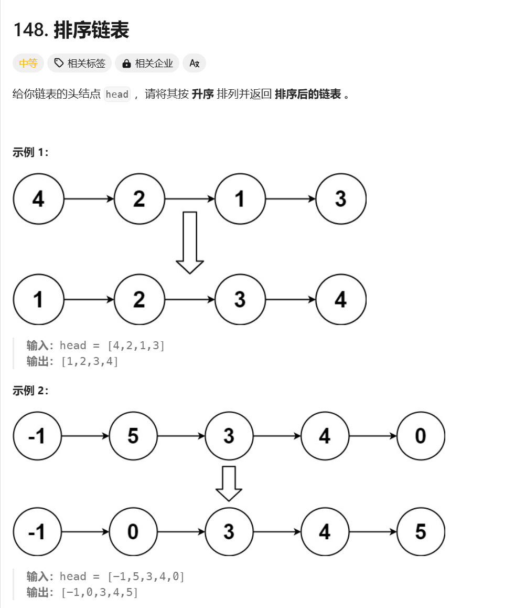

# 题目名称

## 📝 题目链接
- [排序链表 - LeetCode](https://leetcode.cn/problems/sort-list)

## 📷 题目截图

## 💡 解题思路
### 方法:
结合下面两道原题:
- https://leetcode.cn/problems/merge-two-sorted-lists/description/
- https://leetcode.cn/problems/middle-of-the-linked-list/description/
- 
## 📊 代码实现
```java
/**
 * Definition for singly-linked list.
 * public class ListNode {
 *     int val;
 *     ListNode next;
 *     ListNode() {}
 *     ListNode(int val) { this.val = val; }
 *     ListNode(int val, ListNode next) { this.val = val; this.next = next; }
 * }
 */
class Solution {
    public ListNode sortList(ListNode head) {
        if (head == null || head.next == null) {
            return head;
        }

        ListNode mid = getMidPrev(head);
        ListNode head2 = mid.next;
        mid.next = null;
        head = sortList(head);
        head2 = sortList(head2);
        return mergeTwoList(head, head2);
    }

    ListNode getMidPrev(ListNode head) {
        ListNode slow = head, fast = head;
        while (fast.next != null && fast.next.next != null) {
            slow = slow.next;
            fast = fast.next.next;
        }
        return slow;
    }

    public ListNode mergeTwoList(ListNode list1, ListNode list2) {
        ListNode l1 = list1;
        ListNode l2 = list2;
        ListNode dummy = new ListNode(0);
        ListNode go = dummy;
        while (l1 != null && l2 != null) {
            if (l1.val < l2.val) {
                ListNode temp = new ListNode(l1.val);
                go.next = temp;
                go = temp;
                l1 = l1.next;
            } else {
                ListNode temp = new ListNode(l2.val);
                go.next = temp;
                go = temp;
                l2 = l2.next;
            }
        }
        if (l1 != null) {
            go.next = l1;
        } else {
            go.next = l2;
        }

        return dummy.next;
    }
}
```
