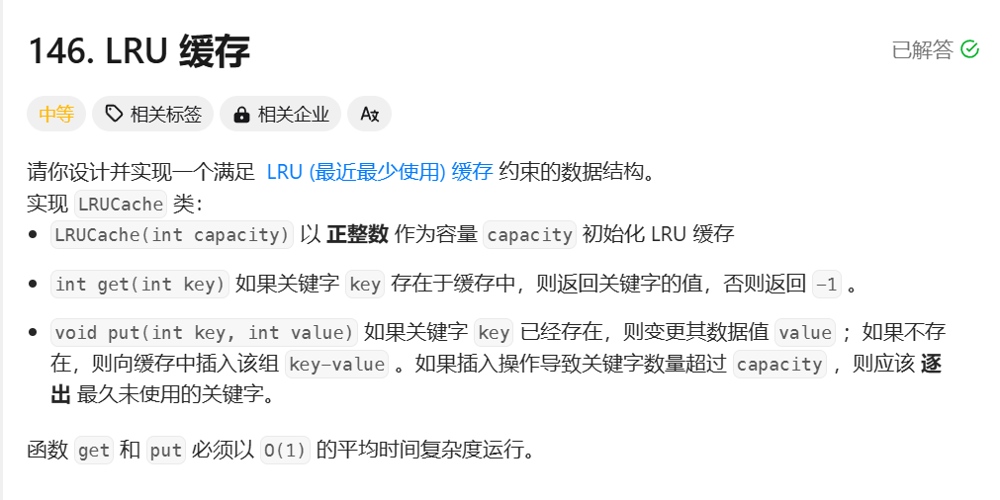

# 146. LRU 缓存

## 📝 题目链接

- [146. LRU 缓存 - LeetCode](https://leetcode.cn/problems/lru-cache/description/)

## 📷 题目截图



## 💡 解题思路
一把c了
### 方法:

## 📊 代码实现

```java
class LRUCache {
    class Node {
        int key, val;
        Node prev;
        Node next;

        public Node(int k, int v) {
            key = k;
            val = v;
        }
    }

    Map<Integer, Node> kTNMap = new HashMap<>();
    Node dummy = new Node(0, 0);
    int capacity;

    public LRUCache(int c) {
        capacity = c;
        dummy.next = dummy;
        dummy.prev = dummy;
    }

    public int get(int key) {
        Node node = getNode(key);
        if (node != null) {
            return node.val;
        }
        return -1;
    }

    public void put(int key, int value) {
        Node node = getNode(key);
        if (node != null) {
            node.val = value;
            return;
        }
        node = new Node(key, value);
        kTNMap.put(key, node);
        putHead(node);
        if (kTNMap.size() > capacity) {
            Node prev = dummy.prev;
            kTNMap.remove(prev.key);
            remove(prev);
        }
    }

    public Node getNode(int key) {
        Node node = kTNMap.get(key);
        if (node != null) {
            remove(node);
            putHead(node);
            return node;
        }
        return null;
    }

    public void remove(Node x) {
        x.prev.next = x.next;
        x.next.prev = x.prev;
    }

    public void putHead(Node x) {
        Node temp = dummy.next;
        x.prev = dummy;
        x.next = temp;
        dummy.next = x;
        temp.prev = x;
    }
}

/**
 * Your LRUCache object will be instantiated and called as such:
 * LRUCache obj = new LRUCache(capacity);
 * int param_1 = obj.get(key);
 * obj.put(key,value);
 */
```
