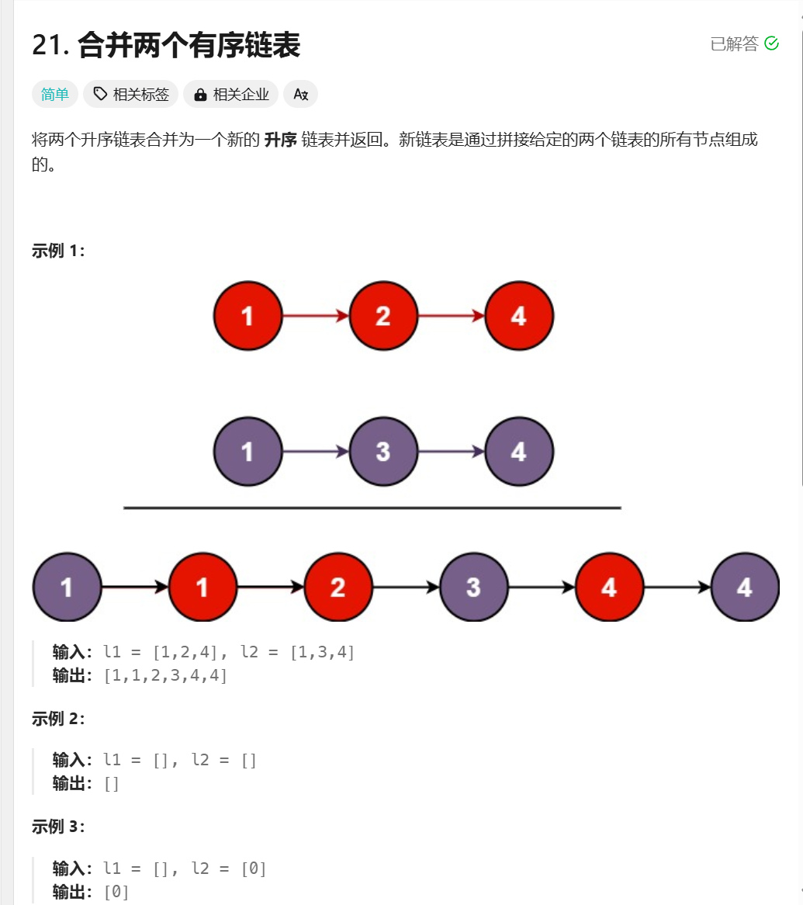

# 合并两个有序链表

## 📝 题目链接

- [合并两个有序链表 - LeetCode](https://leetcode.cn/problems/merge-two-sorted-lists/description/)

## 📷 题目截图



## 💡 解题思路

### 方法

- 重新创建一个链表, 遍历两个链表，值小的先加入新创建的链表中。

#### 复杂度分析

...

## 📊 代码实现

```java
/**
 * Definition for singly-linked list.
 * public class ListNode {
 *     int val;
 *     ListNode next;
 *     ListNode() {}
 *     ListNode(int val) { this.val = val; }
 *     ListNode(int val, ListNode next) { this.val = val; this.next = next; }
 * }
 */
class Solution {
    public ListNode mergeTwoLists(ListNode list1, ListNode list2) {
        ListNode l1 = list1;
        ListNode l2 = list2;
        ListNode dummy = new ListNode(0);
        ListNode go = dummy;
        while (l1 != null && l2 != null) {
            if (l1.val < l2.val) {
                ListNode temp = new ListNode(l1.val);
                go.next = temp;
                l1 = l1.next;
                go = temp;

            } else {
                ListNode temp = new ListNode(l2.val);
                go.next = temp;
                l2 = l2.next;
                go = temp;
            }
        }
        if (l1 != null) {
            go.next = l1;
        } else {
            go.next = l2;
        }
        return dummy.next;
    }
}
```
