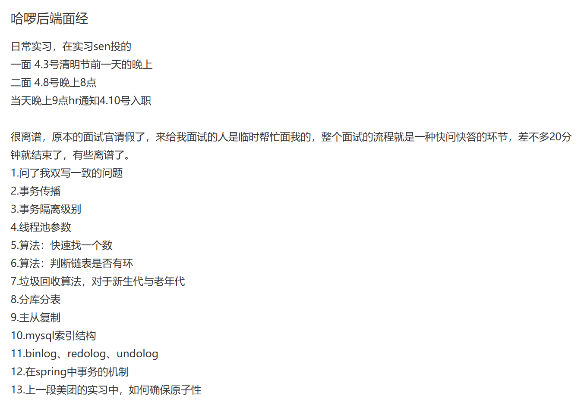
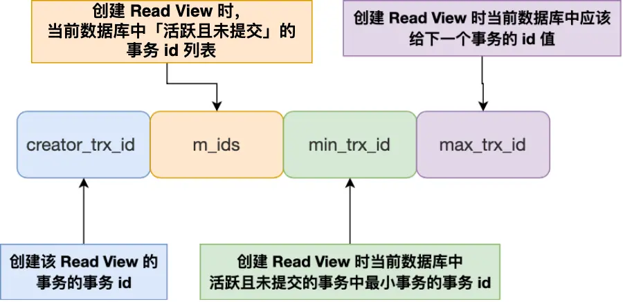
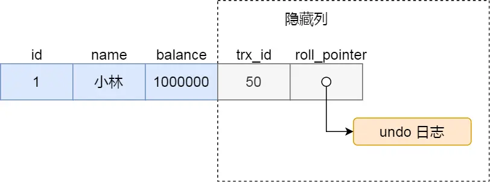
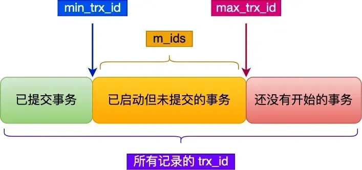

# 🚀 哈啰一面真题
----

    

        题目来源
    

    <a href="https://www.nowcoder.com/feed/main/detail/55c8366545de4a1cb7c45f44b2287e6b?sourceSSR=search" 
       target="_blank"
       style="
           color: #4f46e5;
           text-decoration: none;
           font-weight: 500;
           display: inline-block;
           margin-top: 0.5rem;
       ">
        🔗 牛客网原帖链接
    </a>

    

        

            <svg width="20" height="20" viewBox="0 0 24 24" fill="#6366f1">
                <path d="M12 2C6.48 2 2 6.48 2 12s4.48 10 10 10 10-4.48 10-10S17.52 2 12 2zm1 15h-2v-6h2v6zm0-8h-2V7h2v2z"/>
            </svg>
        

        <h3 style="margin:0;color:#1e293b;">题目内容</h3>
    

    

        
        
题目截图

    

## 1. 常用集合，介绍HashMap与CurrentHashMap的区别

- HashMap 不是线程安全的。CurrentHashMap 是线程安全的，主要是
    - ConcurrentHashMap 1.7 版本内部维护了一个 `Segment` 数组，每个 `Segment` 继承自 `ReentrantLock`
      ，并管理哈希表的一部分。并发写操作只有在操作同一个 Segment 时才会阻塞，访问不同 Segment
      的写操作可以并行，读操作在大多数情况下甚至无需加锁，这大大提高了并发性能。
    - CurrentHashMap 1.8 版本的并发控制粒度更细。它不再有 `Segment` 这种结构，而是直接在每个哈希桶（数组元素）上进行同步
        - 对于数组元素的更新，或者链表/红黑树中节点的添加、删除等操作，通常是**锁定该哈希桶的头节点**，这里使用了
          `synchronized` 关键字（JVM 在这方面做了优化）。
        - 对于一些非阻塞的操作，如数组的初始化、扩容过程中的状态更新、链表转红黑树等，会利用 **CAS 操作**配合 `volatile`
          变量来实现高效的无锁或低锁同步。
- **Null 键和 Null 值**: `HashMap` 允许存储 `null` 键和 `null` 值。`ConcurrentHashMap` **不允许**存储 `null` 键和 `null`
  值（尝试放入 null 键或 null 值会抛出 `NullPointerException`）。这是为了在并发环境下避免歧义和同步问题，因为 `get(key)`
  方法返回 `null` 可能意味着键不存在，也可能意味着键存在但其值为 `null`，在并发环境下难以区分。

## 2. synchronized与ReentrantLock的区别

1. synchronized 基于 JVM 的锁，ReentrantLock 基于JAVA 的 API ，主要依赖于 AQS (AbstractQueuedSynchronizer) 框架实现的。

2. ReentrantLock 公平/非公平(默认是非公平)。synchronized 是非公平。

3. ReentrantLock 手动加/解锁，synchronized 自动加/解锁。

4. ReentrantLock 支持`lockInterruptibly()`方法实现可中断的锁等待，`synchronized ` 不支持线程锁等待的中断，线程只能等待锁的释放。

5. ReentrantLock 支持通过`tryLock`  设置超时时间，避免死锁。`synchronized`不支持线程等待锁的超时控制。

> 补充AQS
>
> AQS 起到了一个抽象、封装的作用，将一些排队，入队，中断等方法提取出来，便于其他相关的JUC 锁的使用。
>
> 它主要维护了一个 共享状态 state, 和一个先进先出的 FIFO 的等待队列。来管理线程对共享资源的访问。
>
> state 由 voliate 修饰，表示当前资源的状态，在独占锁中，state=0/1 占用/
>
> 当线程尝试获取资源失败时，会会被加入到 AQS 等待队列中。这个队列是一个变体的CLH ，采用双向链表的结构。节点包含了线程的引用，等待状态以及前驱和后继节点的指针
>
> AQS 常见的实现就是 ReentrantLock。

## 3. 公平锁的底层实现

公平锁的核心在于“先来先得”的原则，它保证了多个线程在尝试获取锁时，是按照它们请求锁的顺序来获得锁的。这与非公平锁不同，非公平锁允许“插队”，即新来的线程在某些情况下可能比等待队列中的线程先获取锁。公平锁的实现成本通常比非公平锁高一些，吞S吐量可能略低，但能避免线程饥饿。

Java 中 ReentrantLock 的公平模式实现主要依赖于 (AQS) 框架。AQS
内部维护了一个双向链表组成的等待队列，用于存放那些未能成功获取锁而被阻塞的线程。每个节点代表一个等待的线程，并存储了线程的状态信息。

线程尝试获取公平锁时，首先会检查同步状态（表示锁是否被持有）。关键在于，即使当前同步状态是空闲的（锁可用），它还会进一步检查 AQS
的等待队列中是否已有线程在排队。这个检查通常通过调用 `hasQueuedPredecessors()` 方法来实现。

如果 `hasQueuedPredecessors()` 返回
true，意味着队列中已经有其他线程在等待锁了，那么当前线程即使看到锁是空闲的，也不会立即尝试获取锁，而是乖乖地加入到 AQS
的等待队列末尾排队。这是实现公平性的核心逻辑，确保等待的线程优先

只有当同步状态空闲 **并且** `hasQueuedPredecessors()` 返回
false（即等待队列中没有线程或者当前线程就是队列的头一个），当前线程才会尝试去修改同步状态，独占锁资源。如果尝试成功，线程获得锁；如果失败（例如并发竞争），则同样会进入等待队列。

当持有锁的线程释放锁时，它会唤醒等待队列中的头节点线程。被唤醒的线程（现在是队列的头一个）将有机会尝试获取锁。由于公平锁的排队机制，通常情况下，被唤醒的线程能够成功获取到锁，从而保证了“先入先出”的顺序。

## 4. Spring的循环依赖问题，以及解决方案

Spring 通过三级缓存和提前暴露未初始化完成的 Bean 对象来解决循环依赖问题。这一机制的核心是打破 Bean
创建过程中的“先完全初始化再暴露”的常规流程，允许在部分初始化阶段共享对象引用。

1. 三级缓存的作用
   Spring 使用三个 Map（即三级缓存）管理 Bean 的不同状态：  
   ● singletonObjects：存放完全初始化后的单例 Bean。  
   ● earlySingletonObjects：存放已实例化但未完成初始化的 Bean（早期引用）。  
   ● singletonFactories：存放 Bean 的工厂对象（ObjectFactory），用于生成早期引用。
   核心逻辑：当检测到循环依赖时，Spring 会通过 singletonFactories 提前生成一个未完成初始化的 Bean 引用，供其他 Bean 依赖注入使用。
2. Bean 创建流程中的关键步骤
   以 Bean A 依赖 Bean B、Bean B 又依赖 Bean A 为例：  
   ● 步骤 1：创建 Bean A 时，调用构造器实例化 A，此时 A 尚未完成属性填充，会被包装为 ObjectFactory 存入
   singletonFactories。  
   ● 步骤 2：为 A 注入属性时，发现需要 Bean B，触发 B 的创建。  
   ● 步骤 3：创建 Bean B 时，同样实例化 B 并存入 singletonFactories。  
   ● 步骤 4：为 B 注入属性时，发现需要 Bean A，此时会从 singletonFactories 获取 A 的工厂对象，生成 A 的早期引用并存入
   earlySingletonObjects，完成 B 的初始化。  
   ● 步骤 5：B 初始化完成后，A 继续完成属性注入和初始化流程。 

关键点：通过提前暴露未初始化的 Bean 引用，Spring 切断了循环依赖的等待链条。  

## 5. MySQL 为什么选择 B+ 树?
MySQL 默认的存储引擎 InnoDB 采用的是 B+ 作为索引的数据结构，原因有：

- B+ 树的非叶子节点不存放实际的记录数据，仅存放索引，因此数据量相同的情况下，相比存储即存索引又存记录的 B 树，B+树的非叶子节点可以存放更多的索引，
因此 B+ 树可以比 B 树更「矮胖」，查询底层节点的磁盘 I/O 次数会更少。

- B+ 树有大量的冗余节点（所有非叶子节点都是冗余索引），这些冗余索引让 B+ 树在插入、删除的效率都更高，比如删除根节点的时候，不会像 B 树那样会发生复杂的树的变化；

- B+ 树叶子节点之间用链表连接了起来，有利于范围查询，而 B 树要实现范围查询，因此只能通过树的遍历来完成范围查询，这会涉及多个节点的磁盘 I/O 操作，范围查询效率不如 B+ 树。

### 为什么不用红黑树?
至于为什么不使用红黑树等二叉查找树结构，主要原因在于数据存储介质的不同。红黑树是高度平衡的二叉树，非常适合数据存储在内存中（如Java的TreeMap）。
但在数据库中，数据存储在磁盘上，每次节点访问都需要进行磁盘I/O。<mark>红黑树的每个节点只包含一个键和两个子节点指针</mark>，导致树的高度相对较高。对于海量数据，
查找路径会非常长，需要大量的磁盘I/O，效率远低于B+树这种为降低磁盘I/O而设计的“矮胖”结构。

## 6. MySQL RR 隔离级别是如何实现的？
InnoDB 实现 `REPEATABLE READ` 隔离级别主要依赖于多版本并发控制（MVCC）。对于普通的 SELECT 查询（不加锁），InnoDB 通过保存数据行的多个版本来实现。
当一个事务开始时，它会读取数据的一个“快照”版本。在事务的整个生命周期内， 对该事务可见的数据版本保持不变，即使其他事务提交了对同一数据的修改，当前事务也看不到这些修改，
从而避免了脏读和不可重复读。
### MVCC 实现

MVCC 允许多个事务同时读取同一行数据，而不会彼此阻塞，每个事务看到的数据版本是该事务开始时的数据版本。这意味着，如果其他事务在此期间修改了数据，正在运行的事务仍然看到的是它开始时的数据状态，从而实现了非阻塞读操作。

对于「读提交」和「可重复读」隔离级别的事务来说，它们是通过 Read View 来实现的，它们的区别在于创建 Read View 的时机不同，大家可以把 Read View 理解成一个数据快照，就像相机拍照那样，定格某一时刻的风景。

- 「读提交」隔离级别是在「每个 select 语句执行前」都会重新生成一个 Read View；
- 「可重复读」隔离级别是执行第一条 select 时，生成一个 Read View，然后整个事务期间都在用这个 Read View。

Read View 有四个重要的字段：

- m_ids：指的是在创建 Read View 时，当前数据库中「活跃事务」的事务 id 列表，注意是一个列表，“活跃事务”指的就是，启动了但还没提交的事务。
- min_trx_id：指的是在创建 Read View 时，当前数据库中「活跃事务」中事务 id 最小的事务，也就是 m_ids 的最小值。
- max_trx_id：这个并不是 m_ids 的最大值，而是创建 Read View 时当前数据库中应该给下一个事务的 id 值，也就是全局事务中最大的事务 id 值 + 1；
- creator_trx_id：指的是创建该 Read View 的事务的事务 id。

对于使用 InnoDB 存储引擎的数据库表，它的聚簇索引记录中都包含下面两个隐藏列：

- trx_id，当一个事务对某条聚簇索引记录进行改动时，就会把该事务的事务 id 记录在 trx_id 隐藏列里；
- roll_pointer，每次对某条聚簇索引记录进行改动时，都会把旧版本的记录写入到 undo 日志中，然后这个隐藏列是个指针，指向每一个旧版本记录，于是就可以通过它找到修改前的记录。

在创建 Read View 后，我们可以将记录中的 trx_id 划分这三种情况：

一个事务去访问记录的时候，除了自己的更新记录总是可见之外，还有这几种情况：

- 如果记录的 `trx_id` 值小于 `Read View` 中的 `min_trx_id` 值，表示这个版本的记录是在创建 `Read View` 前已经提交的事务生成的，所以该版本的记录对当前事务 **可见**。

- 如果记录的 `trx_id` 值大于等于 `Read View` 中的 `max_trx_id` 值，表示这个版本的记录是在创建 `Read View` 后才启动的事务生成的，所以该版本的记录对当前事务 **不可见**。

- 如果记录的 `trx_id` 值在 `Read View` 的 `min_trx_id` 和 `max_trx_id` 之间，需要判断 `trx_id` 是否在 `m_ids` 列表中：
    - 如果记录的 `trx_id` 在 `m_ids` 列表中，表示生成该版本记录的活跃事务依然活跃着（还没提交事务），所以该版本的记录对当前事务 **不可见**。
    - 如果记录的 `trx_id` 不在 `m_ids` 列表中，表示生成该版本记录的活跃事务已经被提交，所以该版本的记录对当前事务 **可见**。

这种通过「版本链」来控制并发事务访问同一个记录时的行为就叫 MVCC（多版本并发控制）。

## 7. 如何保证Redis与mysql的缓存一致性
### 方法一:
先更新数据库,在删除缓存 还是 先删除缓存，再更新数据库 ?

核心在于分析两种策略的形成的时间窗口的大小。
- 先删除缓存再更新数据库: 因为更新数据库是相对耗时的，而删除缓存确很快,之间会形成比较长的时间窗口。如果别的请求过来,读取了数据库中的旧数据,还写入缓存就错了!
- 先更新数据库再删除缓存: 此处的时间窗口在更新数据库之后,耗时的操作已经完成了,加上删除缓存很快,之间形成的时间窗口很小。之间就很少有请求的访问了。
### 方法二:
**延迟双删**
针对 「先删除缓存，再更新数据库」的不一致情况, 存在较大的时间窗口, 如果能够在更新完数据库之后,去删除之前错误的缓存数据就好了。

缓存双删的步骤
1. 第一次删除缓存。
2. 更新数据库。
3. 等待一段时间 (延迟)。 这个延迟时间需要根据你的业务场景来确定，理论上应该大于一个典型的读请求从发起、读数据库、到写入缓存的整个过程所需的时间。
4. 第二次删除缓存。(删除了旧缓存数据)
