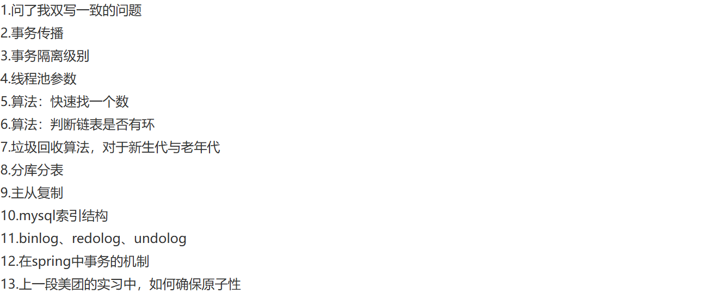

# 🚀 哈啰一面真题
----

    

        题目来源
    

    <a href="https://www.nowcoder.com/feed/main/detail/55c8366545de4a1cb7c45f44b2287e6b?sourceSSR=search" 
       target="_blank"
       style="
           color: #4f46e5;
           text-decoration: none;
           font-weight: 500;
           display: inline-block;
           margin-top: 0.5rem;
       ">
        🔗 牛客网原帖链接
    </a>

    

        

            <svg width="20" height="20" viewBox="0 0 24 24" fill="#6366f1">
                <path d="M12 2C6.48 2 2 6.48 2 12s4.48 10 10 10 10-4.48 10-10S17.52 2 12 2zm1 15h-2v-6h2v6zm0-8h-2V7h2v2z"/>
            </svg>
        

        <h3 style="margin:0;color:#1e293b;">题目内容</h3>
    

    

        
        
题目截图

    

## 事务传播
事务传播行为（propagation behavior）指的是当一个事务方法被另一个事务方法调用时，这个事务方法应如何处理。

例如，`Service A` 里的一个事务方法调用 `Service B` 里的一个事务方法，通常有以下几种解决方案：
1. **融入事务**：直接去掉 `serviceB` 中关于开启事务和提交事务的 `begin` 和 `commit`，将其融入到 `serviceA` 的事务中（直接使用 `ServiceA` 的事务）。不过，`B` 事务出错会导致 `A` 事务回滚。
2. **挂起事务**：若不想让 `B` 事务的错误引发 `A` 事务回滚，可以开启两个连接，一个用于执行 `A`，一个用于执行 `B`，二者互不影响。执行到 `B` 时，将 `A` 挂起，新起连接执行 `B`，`B` 执行完后再唤醒 `A` 继续执行。
3. **嵌套事务**：在 MySQL 中，可通过给 `B` 事务添加 `savepoint` 和 `rollback` 来模拟嵌套事务，把 `B` 设置成伪事务。

Spring 中的事务传播行为如下：
1. **`PROPAGATION_REQUIRED`（需要）**：需要事务。若存在事务，就直接使用当前事务；若没有事务，则开启一个新事务。（若 `A` 存在事务，`B` 融入 `A` 事务；若 `A` 没有事务，则为 `B` 新起一个事务）
2. **`PROPAGATION_SUPPORTS`（支持）**：支持 `A` 的事务。若存在事务，支持当前事务；若没有事务，则以非事务方式执行。（若 `A` 有事务，`B` 融入；若 `A` 没有事务，`B` 非事务执行）
3. **`PROPAGATION_MANDATORY`（强制性）**：强制必须有事务。若当前存在事务，使用该事务；若没有活动的事务，则抛出异常。（若 `A` 有事务，`B` 融入；若 `A` 没有事务，则抛出异常）
4. **`PROPAGATION_REQUIRES_NEW`（需要新的）**：若已有事务存在，先将该事务挂起；若没有事务，则新起一个事务执行。（若 `A` 有事务，将 `A` 事务挂起，新开一个事务执行 `B`，执行完后唤醒 `A` 继续执行；若 `A` 没有事务，则为 `B` 新起一个事务执行）
5. **`PROPAGATION_NOT_SUPPORTED`（不支持）**：不支持事务。总是以非事务方式执行，并挂起任何存在的事务。（若 `A` 有事务，挂起 `A`，`B` 非事务执行，执行完后唤醒 `A`，`A` 继续以事务形式执行）
6. **`PROPAGATION_NEVER`（从不）**：总是以非事务方式执行，若存在活动事务，则抛出异常。（若 `A` 有事务，则抛出异常）
7. **`PROPAGATION_NESTED`（嵌套的）**：若存在活动事务，则在嵌套事务中运行；若没有活动事务，则按 `TransactionDefinition.PROPAGATION_REQUIRED` 属性执行。（若 `A` 有事务，`B` 用 `savepoint` 方式嵌套在 `A` 中执行） 

## 垃圾回收算法
- 标记清除: 先标记所有存活对象，然后清除未被标记的对象。
- 标记整理: 先标记所有存活对象，清除未被标记的对象，并将存活对象向内存一端移动，使它们连续存放，从而减少内存碎片。
- 复制: 将内存划分为两个等大的区域，每次只使用其中一个；标记存活对象后，将其复制到另一个区域，原区域整体清空。
### 新生代和老年代
新生代，大多对象都不会存活，使用复制算法
老年代, 大多对象都会存活，使用标记整理算法

## 分库分表
- 垂直
  - 垂直分库: 比如说一个库中有用户表、积分表、订单表... 难以维护,让一个库就是一张表
    - 每个数据库负责一个独立的业务域
  - 垂直分表: 将一张宽表的字段按访问频率、数据大小或业务相关性进行拆分，形成多个子表，主键保持一致
    - 将常用字段与不常用字段分离
- 水平
  - 水平分库: 将同一张表的数据按一定规则（如 hash、range、list 等）分散到多个数据库中，每个数据库包含该表的部分数据。
    - 各库中表结构相同
  - 水平分表: 在同一个数据库内部，将一张大表的数据按规则拆分成多个子表（partition），结构一致，数据分布不同。
    - 不同于“分库”，所有子表都在同一个数据库中
    - 是一种本地优化手段，不能解决单机容量瓶颈
