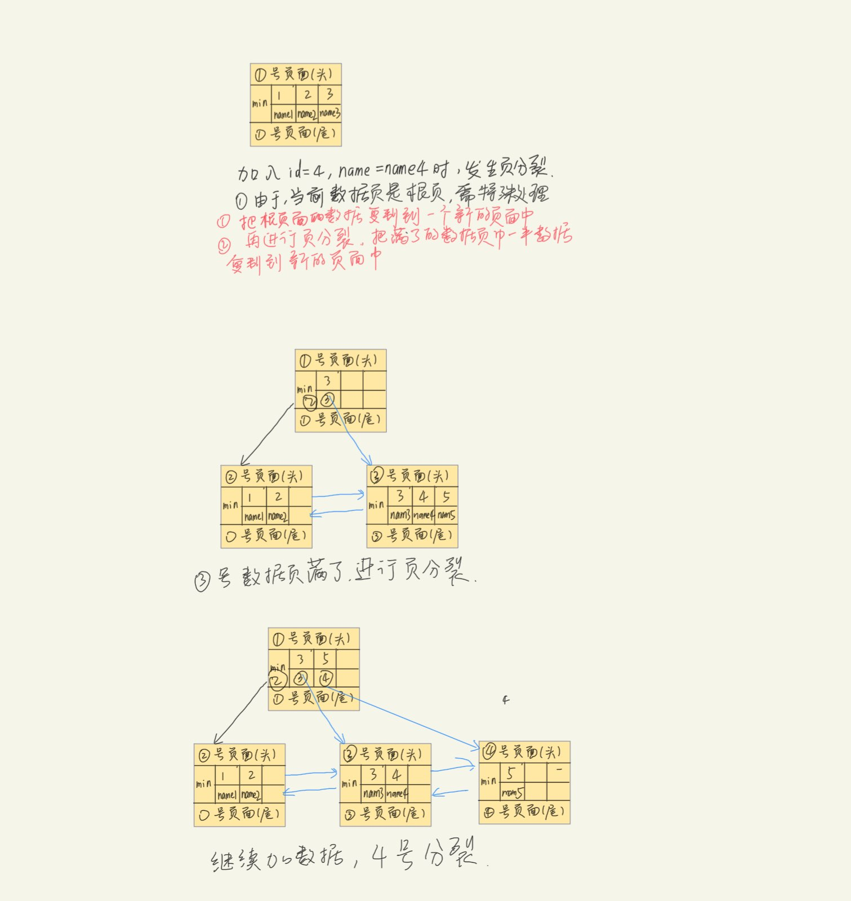
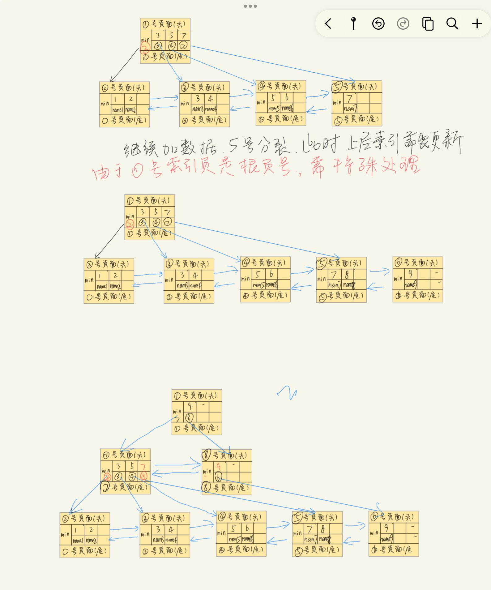

# 哈啰一面真题


## JVM 相关

假设jdk 版本是8，有分代模型。现在JVM 启动了，分析，执行 `Test03 test03 = new Test03()`;
这一行的时候，JVM在哪里区域分配，然后要分配多少?

```java

public class Test03 {
    int a;
    double b;
    long c;
    byte d;

    public static void main(String[] args) {

        Test03 test03 = new Test03();
    }
}
```

**JVM 内存区域**

首先，我们需要了解 JVM 的主要内存区域：

* **堆 (Heap):** 这是 JVM 管理的最大一块内存区域，主要用于存放**对象实例**和**数组**。堆是所有线程共享的。垃圾收集器主要就是管理堆内存。
* **栈 (Stack):** 每个线程在创建时都会创建一个虚拟机栈，内部保存一个个的栈帧 (Stack Frame)，对应着一次次的 Java 方法调用。
  * **局部变量表 (Local Variable Table):** 存放在栈帧中，用于存储方法参数和方法内部定义的局部变量。对于基本数据类型，存放的是它们的值；对于对象引用，存放的是对象在堆中的地址。
* **方法区 (Method Area):** 用于存储已被虚拟机加载的类信息、常量、静态变量、即时编译器编译后的代码等数据。在 JDK 8 中，方法区的具体实现是**元空间 (Metaspace)**，它使用的是本地内存（Native Memory），而不是 JVM 堆内存。
* **程序计数器 (Program Counter Register):** 一块较小的内存空间，可以看作是当前线程所执行的字节码的行号指示器。
* **本地方法栈 (Native Method Stack):** 与虚拟机栈所发挥的作用相似，区别在于虚拟机栈为虚拟机执行 Java 方法（也就是字节码）服务，而本地方法栈则为虚拟机使用到的 Native 方法服务。

**执行 `Test03 test03 = new Test03();` 的内存分配**

现在我们来分析这行代码：

1. **`Test03 test03` (引用变量的分配):**

   * `test03` 是一个局部变量，它是一个对象的引用。
   * 这个引用变量本身会存储在当前线程的**栈 (Stack)** 的**局部变量表**中。
   * 一个引用变量在 64 位 JVM 中通常占用 8 个字节。不过，在 JDK 6 update 23 之后，如果堆内存小于 32GB，JVM 默认会开启**压缩普通对象指针 (Compressed Ordinary Object Pointers, CompressedOops)**。开启后，引用会占用 4 个字节。我们假设这里开启了 CompressedOops。
2. **`new Test03()` (对象的分配):**

   * `new Test03()` 这部分会在 JVM 的**堆 (Heap)** 中创建一个 `Test03` 类的实例对象。
   * **对象在堆中的分配位置 (结合分代模型):**
     * JVM 的堆通常采用**分代收集算法 (Generational Collection)** 进行管理。堆被划分为：
       * **新生代 (Young Generation):** 大部分新创建的对象首先会被分配在新生代。新生代又可以细分为：
         * **伊甸园区 (Eden Space):** 新对象主要分配在这里。
         * **幸存者区 (Survivor Space):** 有两个，通常称为 S0 和 S1 (或者 From 和 To)。当 Eden 区满进行 Minor GC 后，存活的对象会被复制到其中一个 Survivor 区。
       * **老年代 (Old Generation / Tenured Generation):** 在新生代中经历了多次 Minor GC 仍然存活的对象，或者是一些大对象，会晋升到老年代。
     * 因此，`new Test03()` 创建的这个 `Test03` 对象实例**首先会被尝试分配在新生代的伊甸园区 (Eden Space)**。
3. **对象实例内部的内存分配 (在堆中):**

   * 一个 Java 对象在内存中通常包括以下几个部分：

     * **对象头 (Object Header):**
       * **Mark Word:** 存储对象自身的运行时数据，如哈希码、GC 分代年龄、锁状态标志、线程持有的锁、偏向线程 ID、偏向时间戳等。在 64 位 JVM 中，Mark Word 通常占用 8 个字节。
       * **类型指针 (Klass Pointer):** 指向该对象所属类的元数据（即 `Test03` 这个类在方法区/元空间中的信息）。如果开启了 CompressedOops，类型指针通常占用 4 个字节；否则占用 8 个字节。我们假设开启了 CompressedOops。
       * **数组长度 (Array Length):** 如果是数组对象，还会有这部分，用于记录数组长度。`Test03` 不是数组，所以没有这部分。
     * **实例数据 (Instance Data):** 这部分存储对象的成员变量的值。
       * `int a;`：占用 4 个字节。
       * `double b;`：占用 8 个字节。
       * `long c;`：占用 8 个字节。
       * `byte d;`：占用 1 个字节。
     * **对齐填充 (Padding):** JVM 要求对象的大小必须是某个字节数的整数倍（通常是 8 字节）。如果对象头和实例数据加起来的大小不是 8 的倍数，就需要进行对齐填充，补足到最接近的 8 的倍数。
   * **计算 `Test03` 对象实例所需内存大小 (假设开启 CompressedOops):**

     * 对象头 (Mark Word + Klass Pointer) = 8 字节 + 4 字节 = 12 字节
     * 实例数据 (a + b + c + d) = 4 字节 + 8 字节 + 8 字节 + 1 字节 = 21 字节
     * 两者相加：12 字节 + 21 字节 = 33 字节
     * 对齐填充：33 字节不是 8 的倍数，需要填充到 40 字节 (因为 $33 < 40$ 且 $40 \pmod 8 = 0$)。
   * 所以，`Test03` 对象实例在堆中大约会占用 **40 个字节**。
4. **`test03 = new Test03()` (赋值操作):**

   * `new Test03()` 执行完毕后，会返回新创建对象在堆中的内存地址。
   * 这个内存地址会被赋值给栈中存储的 `test03` 这个引用变量。

**总结**

当执行 `Test03 test03 = new Test03();` 这行代码时：

* **JVM 在哪里区域分配？**

  * **栈 (Stack):** 分配引用变量 `test03`。它存储的是对象的地址。
  * **堆 (Heap):** 分配 `Test03` 的对象实例。具体来说，通常是在新生代的 **Eden 区**。
* **要分配多少？**

  * **栈上引用变量 `test03`:**
    * 如果开启了 CompressedOops (堆大小 < 32GB 时默认开启)，则占用 **4 字节**。
    * 如果未开启 CompressedOops，则占用 **8 字节**。
  * **堆上 `Test03` 对象实例:**
    * 对象头：Mark Word (8 字节) + Klass Pointer (4 字节，假设 CompressedOops 开启) = 12 字节。
    * 实例数据：`int a` (4 字节) + `double b` (8 字节) + `long c` (8 字节) + `byte d` (1 字节) = 21 字节。
    * 总大小：12 + 21 = 33 字节。
    * 对齐填充：由于 JVM 通常要求对象大小为 8 字节的倍数，所以会填充到 **40 字节**。

**分代模型的影响:**

* 新创建的 `Test03` 对象会首先进入新生代的 Eden 区。
* 当 Eden 区满时，会触发 Minor GC (也叫 Young GC)。
* 在 Minor GC 过程中，仍然存活的对象（比如 `test03` 引用的这个对象，如果 `test03` 仍然在作用域内且没有被置为 `null`）会被移动到 Survivor 区 (S0 或 S1)。同时，对象的 GC 分代年龄会增加。
* 如果对象在 Survivor 区经历了一定次数的 Minor GC (默认是 15 次，可以通过 `-XX:MaxTenuringThreshold` 参数调整) 仍然存活，或者 Survivor 区空间不足以容纳，它就会被晋升到老年代。
* 如果对象一开始就很大 (例如一个巨大的数组)，超出了新生代的阈值 (可以通过 `-XX:PretenureSizeThreshold` 参数设置，但这个参数需要与特定的垃圾收集器配合，并且通常用于 Parallel Scavenge 和 Serial 收集器)，它可能会被直接分配到老年代。不过对于 `Test03` 这种小对象，通常不会发生这种情况。

## 实现 JDK动态代理Demo

**步骤1：定义一个接口**

**Java**

```java
// 1. 定义一个接口
interface UserService {
    void addUser(String username);
    String getUser(String userId);
}
```

**步骤2：创建真实对象（被代理的对象）**

**Java**

```java
// 2. 创建真实对象的实现类
class UserServiceImpl implements UserService {
    @Override
    public void addUser(String username) {
        System.out.println("执行数据库操作：添加用户 " + username);
    }

    @Override
    public String getUser(String userId) {
        System.out.println("执行数据库操作：查询用户 " + userId);
        return "用户：" + userId;
    }
}
```

**步骤3：创建 InvocationHandler 实现类**

这是代理的核心逻辑所在。

**Java**

```java
import java.lang.reflect.InvocationHandler;
import java.lang.reflect.Method;
import java.lang.reflect.Proxy;

// 3. 创建 InvocationHandler 实现类
class LoggingInvocationHandler implements InvocationHandler {
    private Object target; // 被代理的真实对象

    public LoggingInvocationHandler(Object target) {
        this.target = target;
    }

    /**
     * 当代理对象的方法被调用时，此方法会被执行
     *
     * @param proxy  代理对象本身（很少使用）
     * @param method 被调用的方法对象
     * @param args   被调用方法的参数
     * @return 方法的返回值
     * @throws Throwable
     */
    @Override
    public Object invoke(Object proxy, Method method, Object[] args) throws Throwable {
        System.out.println("[日志] 方法 " + method.getName() + " 即将被执行...");

        // 调用真实对象的方法
        Object result = method.invoke(target, args);

        System.out.println("[日志] 方法 " + method.getName() + " 执行完毕，结果为: " + result);
        return result;
    }
}
```

**步骤4：使用 Proxy.newProxyInstance() 创建代理对象并调用**

**Java**

```java
public class DynamicProxyDemo {
    public static void main(String[] args) {
        // 1. 创建真实对象
        UserService realUserService = new UserServiceImpl();

        // 2. 创建 InvocationHandler，并将真实对象传递进去
        InvocationHandler handler = new LoggingInvocationHandler(realUserService);

        // 3. 使用 Proxy.newProxyInstance() 创建代理对象
        //    参数1: 类加载器 (通常是被代理类的类加载器)
        //    参数2: 代理类需要实现的接口数组
        //    参数3: InvocationHandler 实例
        UserService proxyUserService = (UserService) Proxy.newProxyInstance(
                realUserService.getClass().getClassLoader(),
                realUserService.getClass().getInterfaces(), // 或者 new Class[]{UserService.class}
                handler
        );

        // 4. 通过代理对象调用方法
        System.out.println("------ 调用 addUser ------");
        proxyUserService.addUser("张三");

        System.out.println("\n------ 调用 getUser ------");
        String user = proxyUserService.getUser("1001");
        System.out.println("主程序收到用户: " + user);

        // 你可以看看代理对象的实际类型是什么
        System.out.println("\n代理对象的实际类型: " + proxyUserService.getClass().getName());
        // 输出通常是：com.sun.proxy.$Proxy0 (数字可能不同)
    }
}
```

**总结一下面试官“逆推”的意思：**

面试官是希望你从“为什么需要代理？”、“代理需要做什么？”这些根本问题出发，联想到JDK动态代理提供的解决方案，即通过 `InvocationHandler` 来定义行为，通过 `Proxy.newProxyInstance()` 来生成符合特定接口的代理实例。这样就能自然而然地理解为什么不能直接 `new Proxy()`，以及如何正确使用JDK动态代理了。


## mysql索引：b+树的生成过程。



参考视频: https://www.bilibili.com/video/BV1Ai4y127EF/