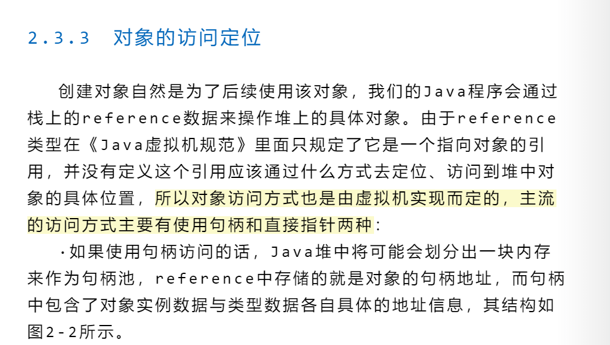

## 心得



## 对象实例数据与类型数据

假设有如下Java类定义：

```java
public class Person {
    String name;
    int age;
}
```

当你在代码中写下：

```java
Person p = new Person();
p.name = "Alice";
p.age = 30;
```

在JVM中，p是一个引用变量。假设采用“句柄访问”方式，JVM会在堆中为Person对象分配一块内存用于存储实例数据，
同时在句柄池中分配一块内存用于存储句柄。p变量中存储的是句柄的地址。

****对象实例数据**：**

这部分数据存储在堆内存的某个区域，内容包括该对象的所有实例字段的实际值。对于上面的例子，

`p`对象的实例数据就是`name`字段的引用（指向字符串"Alice"的地址）和`age`字段的值（30）。每个`Person`对象的实例数据都是独立的。

****类型数据**：**

类型数据是描述`Person`类本身的信息，通常由JVM的“方法区”或“元空间”存储。它包括：

* 类的名称（如"Person"）
* 父类信息（如`java.lang.Object`）
* 字段表（如`name`是`String`类型，`age`是`int`类型）
* 方法表（如构造方法、`toString()`等）
* 访问修饰符（如public、private等）
* 运行时常量池
* 其他元数据（如类加载器引用等）

<font style=" color:blue">所有Person对象共享同一份类型数据。类型数据不会因为你创建了多少个Person对象而重复分配。</font>

**句柄结构示意**：

```java
句柄地址
 ├─ 指向实例数据的指针（如0x1000，堆内存中p对象的实际数据）
 └─ 指向类型数据的指针（如0x2000，方法区中Person类的元数据）
```

当你通过p.name访问字段时，JVM会先通过p找到句柄，再通过句柄中的实例数据指针找到实际的对象数据，
再根据类型数据指针找到字段的偏移量和类型信息，最终定位到name字段的值。
