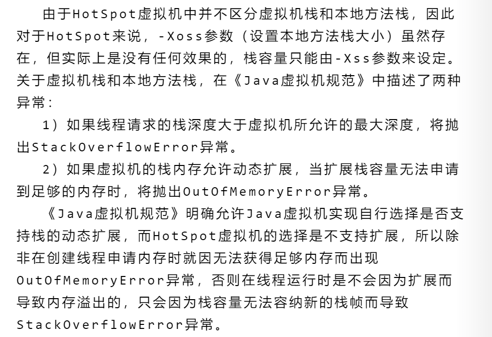

# 心得

## 栈内存分配

总结来讲: 虚拟机栈分为可以动态扩展和不可动态扩展的栈。

- 不可以动态扩展，比如 HotSpot 虚拟机不支持，如果线程请求的栈深度大于虚拟机所允许的最大深度，抛出 `StackOverflowError 异常` ，除非
  在创建线程申请内存时就无法获取内存出现OOM。
- 可以动态扩展，当扩展栈的容量无法申请到足够的内存时，抛出 `OutOfMemoryError` 异常。
