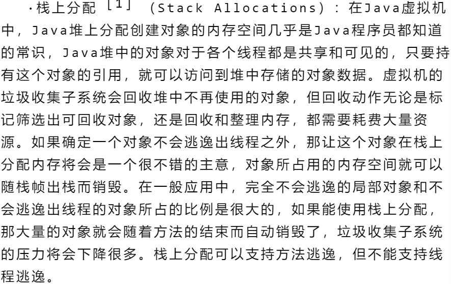

# 栈上分配

## 栈上分配

在 `JAVA` 中,内存主要划分为堆和栈，栈主要用于存储方法调用的信息(栈帧)，包括局部变量和操作数栈，堆则用于动态分配对象示例和数组。

对于**基本数据类型**,当他们作为方法的局部变量声明时，其值直接存储在对应的方法栈帧中的局部变量表中，这意味着它们的分配和回收都
很高效，随着方法的调用的开始和结束而自动进行，然而，若基本类型作为类的成员变量(实例字段)，它们将作为对象数据的一部分，随着
对象实例存储在堆内存中。

对于**引用数据类型**，情况更复杂，当在方法内声明一个引用类型的局部变量时，（例如 `Object obj = new Object();`），
变量 `obj` 本身（即引用，它存储的是对象的内存地址）<mark>是分配在栈上的</mark>。而 `new Object()` 所创建的对象实例，
默认情况下是分配在堆内存中的。**这个栈上的引用指向堆上的对象实例。**

**逃逸分析** 是一种重要的编译器优化技术。其核心目的是分析对象动态作用域：
判断一个对象在方法中被创建后，是否可能被方法外部的代码所访问（即“逃逸”）。如果一个对象在方法内部创建，
并且其生命周期完全局限于该方法内，不会被返回，不会赋值给外部变量，也不会在其他线程中被访问，那么这个对象就被认为是“非逃逸的”。

对于非逃逸对象，编译器可以进行优化。其中一项关键优化就是**栈上分配**。
如果确定一个对象不会逃逸出当前方法，JVM就可能选择不将其分配在堆上，而是直接在当前方法的栈帧上为该对象分配空间。
这样做的好处是显著的：对象可以随着方法调用的结束而自动销毁，无需垃圾收集器介入，从而减轻了GC的压力，
并可能因为数据更接近（缓存友好性）而提升性能。需要强调的是，这里指的是**对象实例本身**被分配在栈上，而不是其引用。
局部引用变量始终在栈上，无论其指向的对象在堆上还是（经过优化后）在栈上。

### 如果是超大的局部变量，不会逃逸出方法，会在栈上分配吗？

**理论上可能，但实践中几乎不会，或者说编译器/JVM会非常谨慎地避免这样做。**

在实际的JVM实现中，栈上分配优化主要针对的是 **较小的、非逃逸的对象** 。对于体积过大的对象，即使它们不逃逸，JVM几乎肯定会选择将它们分配在堆上，以避免栈溢出的风险。这样做虽然会重新引入GC的开销，但保证了程序的健壮性。
